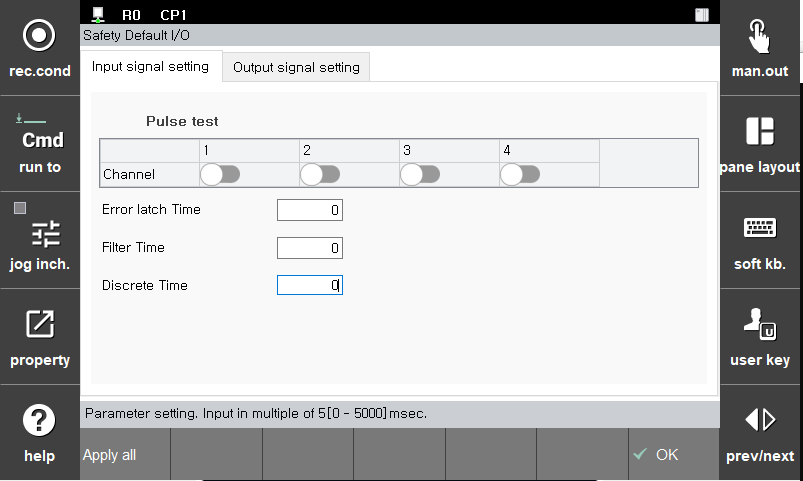
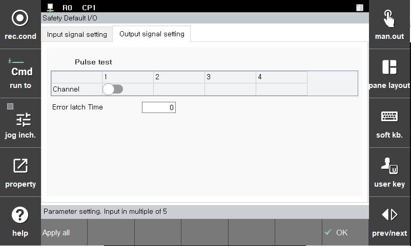

# 3.3.3.1 Default Safety I/O

Set the parameters of Default Safety I/O.
There are 4 input signals and 1 output signal, all of which are dual signals.

**1. Default Safety Input**

 - Pulse Test : You can select whether to use Pulse Test for each channel.
 - Error Latch Time : If an error occurs in a channel, even if the error is recovered, the Fail-Safe value is changed to the currently input signal after the **Error Latch time**.(Unit : msec)
 - Filter Time : For each channel, a consistent signal must be input during the **Filter Time** to be processed as a valid signal. (Unit: msec)
 - Discrete Time : Default Safety Input is treated as a valid signal when two dual signals have the same value, and if these two signals differ for a time greater than the **Discrete time** , an alarm is generated. (Unit : msec)
 
**2. Safety Output**

 - Pulse Test : You can select whether to use Pulse Test for each channel.
 - Error Latch Time : If an error occurs in a channel, even if the error is recovered, the Valid output signal is produced from the Fail-Safe value after the **Error Latch Time** has elapsed. (Unit: msec)

