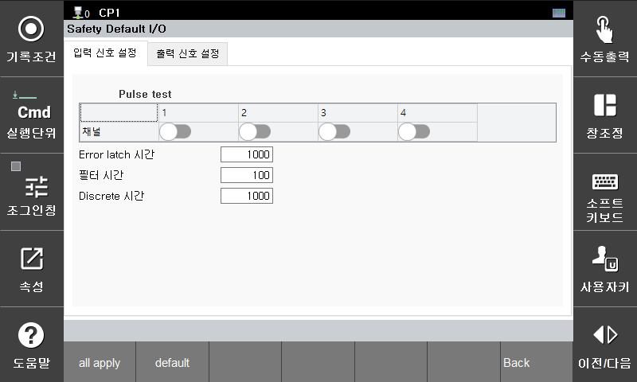
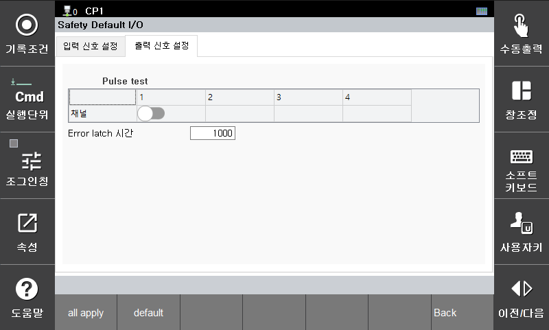

# 3.3.3.1 안전 입출력 신호

안전 입출력 신호의 파라미터를 설정합니다.  
입력 신호는 4개, 출력 신호는 1개이며 모두 이중 신호로 동작합니다.

## 1. 입력 신호 설정

- **Pulse Test** : 각 채널별로 Pulse Test 사용 여부를 설정합니다.  
- **Error Latch 시간** : 각 채널은 에러가 발생한 후 해당 에러가 해소되더라도, **Error Latch 시간**이 경과한 이후에야 Fail-Safe 상태에서 현재 입력 상태로 전환됩니다. (단위: msec)
- **필터 시간** : 각 채널별로 설정된 **필터 시간** 동안 동일한 신호가 입력되어야 유효한 신호로 처리됩니다. (단위 : msec)  
- **Discrete 시간** : 기본 입력 신호는 두 개의 이중 신호가 동일할 때 유효한 신호로 처리됩니다. 두 신호가 설정된 **Discrete 시간** 이상 서로 다르면 알람이 발생합니다. (단위 : msec)  

## 2. 출력 신호 설정

- **Pulse Test** : 각 채널별로 Pulse Test 사용 여부를 설정합니다.  
- **Error Latch 시간** : 각 채널은 에러가 발생한 후 해당 에러가 해소되더라도, **Error Latch 시간**동안 **Open (Fail-safe)** 상태를 유지합니다. 이후 정상 출력으로 전환됩니다. (단위 : msec)  
