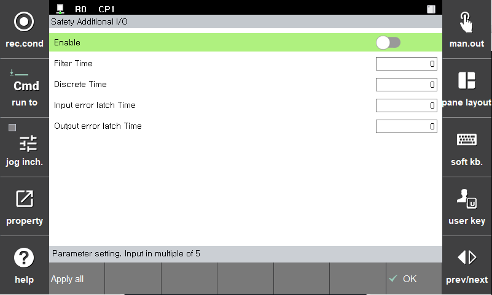

# 3.3.3.2 Additional Safety I/O

Set parameters of Additional Safety I/O.
There are 8 input signals and 4 output signals, and they all operate as dual signals.

**1. Additional Safety Input/Output**

 - Enable : Determines whether to use Additional Safety I/O
 - Filter time : For each channel, a consistent signal must be input during the **Filter Time** to be processed as a valid signal. (Unit: msec)
 - Discrete time : Additional Safety Input is treated as a valid signal when two dual signals have the same value, and if these two signals differ for a time greater than the **Discrete time** , an alarm is generated. (Unit : msec)
 - Input Error Latch time :If an error occurs in a channel, even if the error is recovered, the Fail-Safe value is changed to the currently input signal after the **Error Latch time**.(Unit : msec)
 - Output Error Latch time : If an error occurs in a channel, even if the error is recovered, the Valid output signal is produced from the Fail-Safe value after the **Error Latch Time** has elapsed. (Unit: msec)
 
 

