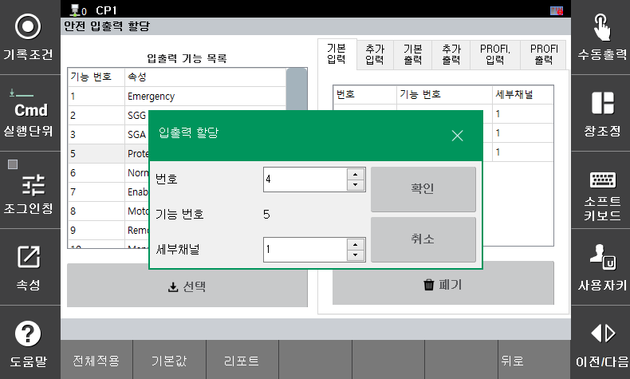

# 3.3.3.3 안전 신호 할당

안전 신호 할당은 안전 입출력, 부가 안전 입출력, 안전 통신 입출력과 같은 외부신호와 로봇 제어기가 가지고 있는 여러가지 논리적 신호(시스템 안전 입출력, 안전 응용프로그램의 신호)를 연결 시켜주는 역할을 합니다.
**\[시스템 > 8: 안전 시스템 > 2: 파라미터 설정 > 3: 안전 입출력 > 1: 입출력 할당]** 메뉴에서 파라미터 값을 설정할 수 있습니다. 

-------------------------------------------------------------------------

### 안전 신호 할당 추가 
1) 좌측 입출력 기능 목록에서 원하는 기능(Function)을 선택
2) **[선택]** 버튼을 누르고 인덱스(H/W 채널 또는 Bit 번호)를 선택
3) 입출력 기능 목록에 따라 세부채널을 선택하여 세부 기능 번호 선택 가능

</img>
<em>
안전 신호 할당 설정 화면
</em>

</img>
<em>
안전 신호 추가 할당 세부 설정 화면
</em>


* 개별 입력 기능 항목은 단 하나의 입력채널과 연결할 수 있습니다. 
* "기본 안전 입력", "부가 안전 입력", "안전통신 입력"은 서로 중복 할당 될수 없습니다. 
* 중복 입력 설정시 "E52030 (x ch) 안전 입력의 할당 중복" 에러가 발생됩니다.



### 안전 신호 할당 삭제 
1) 화면 우측에서 이미 설정된 할당 기능을 선택
2) 아래에 보이는 **[폐기]** 버튼을 누름

---

### 안전 신호의 기본 설정 값

|  **채널** |     **기능**                       | 
| :-------: | :------------------------------------------------: |
| 안전 입력 채널 1 | 외부 비상 정지 입력(Emergency) |
| 안전 입력 채널 2 | 안전 가드 일반 입력(SGG)| 
| 안전 입력 채널 3 | 안전 가드 자동 입력(SGA)|
| 안전 입력 채널 4 | - |
| 안전 출력 채널 1 | 비상 정지 활성화 상태|

### 안전 입력 신호의 기능 리스트

|  **채널** |     **기능**                       |       **설명**    |
| :-------: | :--------------------------: | :--------------------------------------------------: |
| Emergency | 외부 비상 정지 입력| OPEN : 비상정지 활성 CLOSE : 비상정지 해제 |
| SGG| 안전 가드 일반 입력| OPEN : 가드 열림 (위험)  CLOSE : 가드 닫힘 (안전) |
| SGA | 안전 가드 자동 입력| OPEN : 가드 열림 (위험)  CLOSE : 가드 닫힘 (안전) |
| Protective stop | - |
| Normal stop | - |
| Enable Switch | 외부 인에블링 스위치 | OPEN : 스위치 놓음  CLOSE : 운전 가능(모터온 시도) |
| Motor On | 외부 모터온 | 신호 상승시(Rising Edge) 모터온 시도 |
| Remote | 외부 모드 입력(리모트) | OPEN : 내부 모드 신호로 모드 변경  CLOSE : 외부 모드 입력 신호로 모드 변경
| Manual | 외부 모드 입력(수동)  | OPEN : 동작 없음  CLOSE : 외부 수동 모드 입력 |
| Auto | 외부 모드 입력(자동)  | OPEN : 동작 없음  CLOSE : 외부 자동 모드 입력 |
| Arm Limit | 암리밋 입력| OPEN : 리밋 신호 입력 (위험)  CLOSE : 리밋 신호 닫힘 (안전) |
| Primary axis Limit | 주축 리밋 입력 | OPEN : 리밋 신호 입력 (위험)  CLOSE : 리밋 신호 닫힘 (안전) |
| Additional axis Limit | 부가축 리밋 입력 | OPEN : 리밋 신호 입력 (위험)  CLOSE : 리밋 신호 닫힘 (안전) |
| External axis Limit | 확장축 리밋 입력 | OPEN : 리밋 신호 입력 (위험)  CLOSE : 리밋 신호 닫힘 (안전) |
| Monitored standstill #1 ~ #8 | 안전 정지 (sos_0~sos_7) |
| Joint speed set #1 ~ #8 | 조인트 속도 (speed_0~speed_7) |
| TCP speed set #1 ~ #16 | TCP 속도 (speed_0~speed_15) |
| Joint angle #1 ~ #8 | 조인트 영역 (space_0~space7) |
| TCP position(space) #1 ~ #16 | TCP 영역 (space_0~space15) |
| TCP orientation #1 ~ #8 | 툴 방향 (orient_0~orient7) |
| Self collision | 자가 충돌 |
| Power #1 ~ #16 | 파워 (power_0~power_15) |
| Momentum #1 ~ #16 | 모멘텀 (mmt_0~mmt_15) |
| Collision detection #1 ~ #16 | 충돌 검지 (coldet_0~coldet_15) |
| Speed & separation #1 ~ #84 | RePlan |
| Mastering test switch| 마스터링 테스트 스위치 |

### 안전 출력 신호의 기능 리스트
|  **채널** |     **기능**                       |       **설명**    |
| :-------: | :--------------------------: |  :--------------------------------------------------: |
| Emergency stop activation status | 비상 정지 상태 | OPEN : TP, OP, 외부 비상정지 중 하나 이상 눌림   CLOSE : TP, OP, 외부 비상정지 모두 눌리지 않음  |
| Protective stop activation status | |
| Normal stop activation status | |
| Remote mode status | 외부 조작 상태 | OPEN : 내부 조작 모드  CLOSE : 외부 조작 모드 |
| Manual mode status | 수동 모드 상태 | OPEN : 수동 모드 상태 아님   CLOSE : 수동 모드 상태 |
| Auto mode status | 자동 모드 상태 | OPEN : 자동 모드 상태 아님   CLOSE : 자동 모드 상태|
| Motor Off status | 모터오프 상태 | OPEN : 모터온 상태  CLOSE : 모터오프 상태|
| Safety Function activation status | |
| Monitord standstill activation status | |
| Replan(reduced mode) status | |
| Violation alarm | |
| Monitord standstill #1~#8 violation | |
| Joint speed set #1~#8 violation | |
| TCP speed set #1~#16 violation | |
| Joint angle #1~#8 violation | |
| TCP position(cell) #1~#16 violation | |
| TCP orientation #1~#8 violation | |
| Self collision detection | |
| Power #1~#16 violation | |
| Momentum #1~#16 violation | |
| Collition detection #1~#16 violation | |
| Mastering test error | |
| Brake test error | |


* 안전 통신에서 **OPEN = Bit 0**, **CLOSE = Bit 1** 로 정의됨


