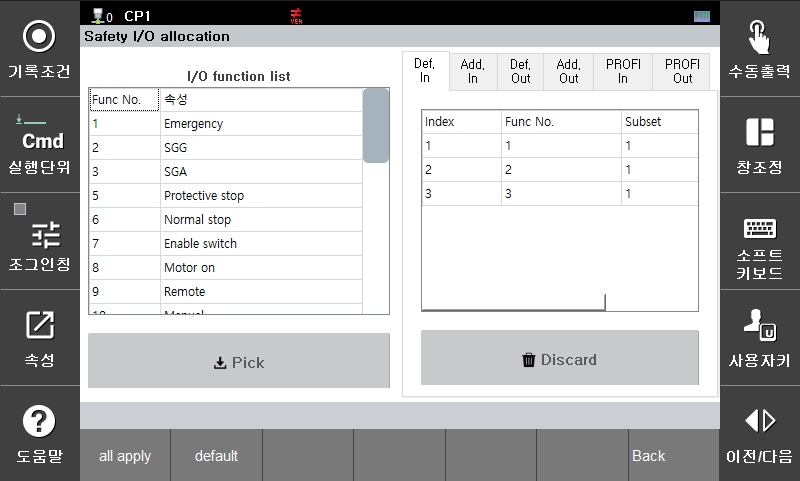

# 3.3.3.3 안전 신호 할당

안전 신호 할당은 안전 입출력, 부가 안전 입출력, 안전 통신 입출력과 같은 외부신호와 로봇 제어기가 가지고 있는 여러가지 논리적 신호 또는 상태 변수를 연결 시켜주는 역할을 합니다.

### 안전 신호 할당 추가 
1) 좌측 I/O function list에서 원하는 기능(Function)을 선택
2) **[PICK]** 버튼을 누르고 인덱스(H/W 채널 또는 Bit 번호)를 선택
3) I/O function list에 따라 Subset을 선택하여 세부 기능 번호 선택 가능


* 개별 입력 기능 항목은 단 하나의 입력채널과 연결할 수 있습니다. 또 "기본 안전 입력", "부가 안전 입력", "안전통신 입력"과도 중복 할당 될수 없습니다. 중복시 "E52030 ( ch) 안전 입력의 할당 중복"의 에러가 발생됩니다.



### 안전 신호 할당 삭제 
1) 화면 우측에서 이미 설정된 할당 기능을 선택
2) 아래에 보이는 **[Discard]** 버튼을 누름

---

### 안전 신호의 기본 설정 값

|  **채널** |     **기능**                       | 
| :-------: | :------------------------------------------------: |
| 안전 입력 채널 1 | 외부 비상 정지 입력(Emergency) |
| 안전 입력 채널 2 | 안전 가드 일반 입력(SGG)| 
| 안전 입력 채널 3 | 안전 가드 자동 입력(SGA)|
| 안전 입력 채널 4 | - |
| 안전 출력 채널 1 | 비상 정지 활성화 상태|

### 안전 신호의 기능 리스트

|  **채널** |     **기능**                       | 
| :-------: | :------------------------------------------------: |
| Emergency | 외부 비상 정지 입력|
| SGG| 안전 가드 일반 입력| 
| SGA | 안전 가드 자동 입력|
| Protective stop | - |
| Normal stop | - |
| Enable Switch | 외부 인에블링 스위치 |
| Motor On | 외부 모터온 |
| Remote | 외부 모드 입력(리모트) |
| Manual | 외부 모드 입력(수동)  |
| Auto | 외부 모드 입력(자동)  |
| Arm Limit | 암리밋 입력|
| Primary axis Limit | 주축 리밋 입력 |
| Additional axis Limit | 부가축 리밋 입력 |
| External axis Limit | 확장축 리밋 입력 |
| Monitored standstill #1 ~ #8 | - |
| Joint speed set #1 ~ #8 | - |
| TCP speed set #1 ~ #16 | - |
| Joint angle #1 ~ #8 | - |
| TCP position(cell) #1 ~ #16 | - |
| TCP orientation #1 ~ #8 | - |
| Self collision | - |
| Power #1 ~ #16 | - |
| Momentum #1 ~ #16 | - |
| Collision detection #1 ~ #16 | - |
| Speed & separation #1 ~ #84 | - |
| Mastering test switch| - |