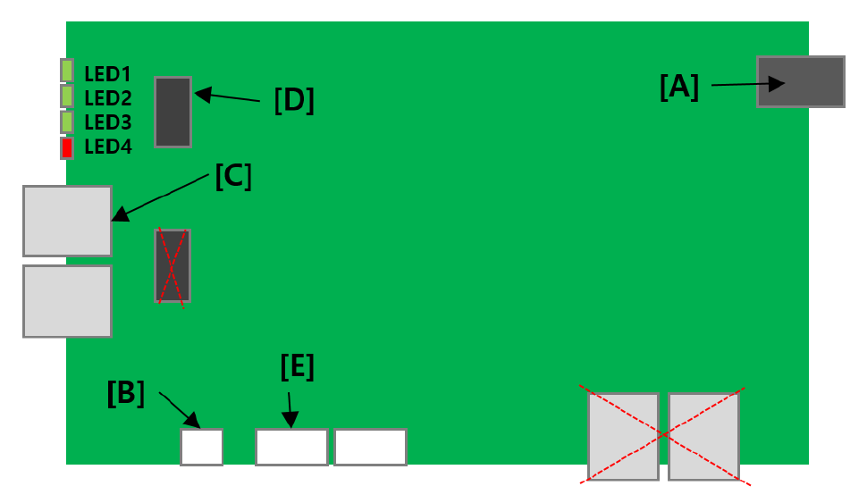



# 3.3.3.4 PROFINET

**1. PROFINET HW(BD671)**

- Power Input : 24Vdc input
- Serial Communication Port : Connect Cable with BD642A Board
- PROFINET I/O Ethernet Port : Connect with PROFINET Master
- F/W Download Port : F/W download via J Link
- RS232 Port 
	- Baudrate : 115200 bps
	- Data : 8bit, Parity : none, Stop bits : 1bit
- LED
	- LED1 : Maintenance LED
	- LED2 :  Diagnosis LED
	- LED3 :  Run LED
	- LED4 :  Error LED
	- DCP ( LED3, LED4 Blinking)

**2. Profinet settings**

PROFINET settings can be changed through RS232 communication of BD671. 
In this chapter, PROFINET and the related parameters are explained.

 - S : Add Sub Module.
 - s : Removes a SubModule.
 - H : Shows a list of currently installed submodules.
 - n : Set the name of the PROFINET
 - N : Set the MAC address of the PROFINET device.
 - o : Set the IP address, Subnet mask, and Gateway.

**3. Moudule information**
 - Module
	 - ID : 0x21
	 - Sub Module ID : 0x2
	 - Description :  8 Bytes I/O PS2v61
	 - Input data Size : 13 Bytes
	 - Output data Size : 13 Bytes
	 - Allowed slot : 1
	 - Allowed subslot :  1

**4. Spec**
	- PNIO Version : V2.43
	- Conformance Class : B
	- Application Class : Functional Safety
	- Net load Class : II
	- MRP (Media Redundancy Protocol)
	- Device Redundancy (S2)
	- Dynamic Reconfiguration (DR)
	- I&M Records 0 ~ 4
	- Supported Protocols : SNMP, LLDP
	- Minimum Device Interval : 1 ms
	- iParameter : Not supported.
	- Parameterization in Run : Not supported.
	- PROFIenergy : Not supported.	 

> Parameter settings using the TP below are in preparation.

 - PROFINET IO Device Name : Set the name of the PROFINET device. The first letters of the device's name are fixed as "HRC-PN-DEV-" and the user can choose the numbers that follow.
 - IP address : Set the IP address. ex) 192.168.1.100
 - Subnet mask : Set the subnet mask. ex)255.255.255.0
 - Gateway : Set the gateway address. ex)192.168.1.1
 - MAC address : This parameter cannot be set and can only be read.