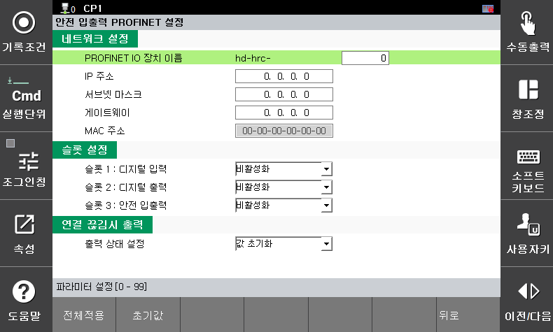

# 3.3.3.4 PROFINET

**1. PROFINET HW(BD671)**

- Power Input : 24Vdc input
- Serial Communication Port : Connect Cable with BD642A Board
- PROFINET I/O Ethernet Port : Connect with PROFINET Master
- F/W Download Port : F/W download via J Link
- RS232 Port 
	- Baudrate : 115200 bps
	- Data : 8bit, Parity : none, Stop bits : 1bit
- LED
	- LED1 : Maintenance LED
	- LED2 :  Diagnosis LED
	- LED3 :  Run LED
	- LED4 :  Error LED
	- DCP ( LED3, LED4 Blinking)

**2. Profinet의 설정**

PROFINET의 설정은 BD671의 RS232 통신을 통해 변경할 수 있습니다.
이번장에서는 PROFINET과 관련된 파라미터에 관해서 설명합니다.

 - S : Sub Module을 추가합니다.
 - s : Sub Module을 제거합니다.
 - H : 현재 설치된 Sub Module의 리스트를 보여줍니다.
 - n :  PROFINET 장치의 이름을 설정합니다.
 - N : PROFINET 장치의 MAC address를 설정합니다.
 - o : IP 주소와 Subnet mask 그리고 Gateway 를 설정 합니다. 

**3. 모듈 정보**
 - 모듈 갯수 : 1 ea
	 - ID : 0x21
	 - Sub Module ID : 0x2
	 - Description :  8 Bytes I/O PS2v61
	 - 입력 데이터 Size : 13 Bytes
	 - 출력 데이터  Size : 13 Bytes
	 - 허용 슬롯 : 1
	 - 허용 서브슬롯 :  1

**4. Spec**
	- PNIO Version : V2.43
	- Conformance Class : B
	- Application Class : Functional Safety
	- Net load Class : II
	- MRP (Media Redundancy Protocol)
	- Device Redundancy (S2)
	- Dynamic Reconfiguration (DR)
	- I&M Records 0 ~ 4
	- Supported Protocols : SNMP, LLDP
	- Minimum Device Interval : 1 ms
	- iParameter : 지원 하지 않습니다.
	- Parameterization in Run : 지원 하지 않습니다.
	- PROFIenergy : 지원하지 않습니다.	 

---

ProfiNet을 구성하는 안전 파라미터는 **\[시스템 > 8: 안전 시스템 > 2: 파라미터 설정 > 3: 안전 입출력 > 4: PROFINET]** 메뉴에서 설정할 수 있습니다.

</img>
<em>
ProfiNet 설정 화면
</em>

| 파라미터           | 설명                                                                                                          | 입력 범위                        | 기본 값   |
|:-------------------------:|:-----------------------------------------------------------------------------------------------------------:|:-------------------------------:|:--------:|
| **네트워크 설정**          |                                                                                                             |                                 |          |
| PROFINET IO 장치 이름       | PROFINET 장치의 이름을 설정합니다. 장치의 이름 앞 글자는 **"HRC-PN-DEV-"** 로 고정, 사용자는 뒤에 붙는 숫자를 선택할 수 있습니다. | 0 ~ 99                          | 0        |
| IP 주소                   | IP 주소를 설정합니다. 예: 192.168.1.100                                                                  | 0.0.0.0 ~ 999.999.999.999       | 0.0.0.0  |
| 서브넷 마스크               | Subnet mask를 설정합니다. 예: 255.255.255.0                                                              | 0.0.0.0 ~ 999.999.999.999       | 0.0.0.0  |
| 게이트웨이                 | 게이트웨이 주소를 설정합니다. 예: 192.168.1.1                                                             | 0.0.0.0 ~ 999.999.999.999       | 0.0.0.0  |
| MAC 주소                  | MAC 주소를 보여줍니다. 이 파라미터는 **읽기 전용**입니다.                                                          | -                               | -        |
| **슬롯 설정**              |                                                                                                             |                                 |          |
| 슬롯 1 (디지털 입력)        | 장치가 연결되어 있을 때 디지털 입력 값을 설정합니다. 연결되지 않으면 **비활성화** 상태로 고정됩니다.                               | 0 / 50 / 120 / 240              | 0        |
| 슬롯 2 (디지털 출력)        | 장치가 연결되어 있을 때 디지털 출력 값을 설정합니다. 연결되지 않으면 **비활성화** 상태로 고정됩니다.                               | 0 / 50 / 120 / 240              | 0        |
| 슬롯 3 (안전 입출력)        | 안전 입출력 사용 여부를 설정합니다. 연결되지 않으면 **비활성화** 상태로 고정됩니다.                                    | yes / no                        | no       |
| **연결 끊김 시 출력**       |                                                                                                             |                                 |          |
| 출력 상태 설정              | 연결이 끊겼을 시 값의 초기화 여부를 설정합니다.                                                                  | 값 초기화 / 값 유지               | 값 초기화 |
