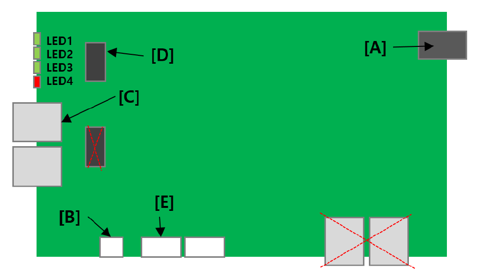
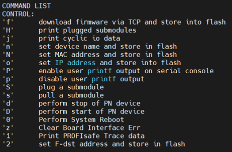
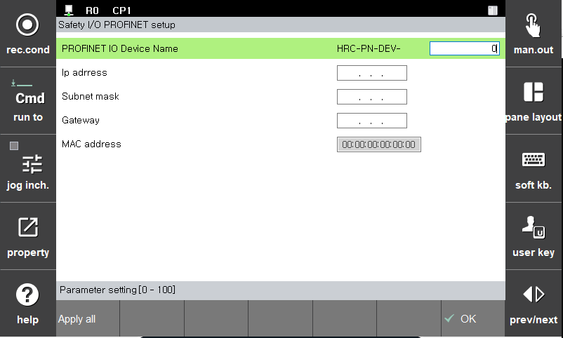



# 3.3.3.4 PROFINET

*1. PROFINET HW(BD671)**

- Power Input : 24Vdc input
- Serial Communication Port : Connect Cable with BD642A Board
- PROFINET I/O Ethernet Port : Connect with PROFINET Master
- F/W Download Port : F/W download via J Link
- RS232 Port
- Baudrate : 115200 bps
- Data : 8bit, Parity : none, Stop bits : 1bit
- LED
- LED1 : Maintenance LED
- LED2 :  Diagnosis LED
- LED3 :  Run LED
- LED4 :  Error LED
- DCP ( LED3, LED4 Blinking)

*2. Profinet设置**

PROFINET的设置可以通过BD671的RS232通信更改。
本章节说明与PROFINET相关的参数。

- S：添加Sub Module。
- s：删除Sub Module。
- H：显示当前安装的Sub Module列表。
- n：设置PROFINET设备的名称。
- N：设置PROFINET设备的MAC address。
- o：设置IP地址、Subnet mask及Gateway。

*3. 模块信息**
- 模块数量：1 ea
- ID : 0x21
- Sub Module ID : 0x2
- Description :  8 Bytes I/O PS2v61
- 输入数据Size：13 Bytes
- 输出数据Size：13 Bytes
- 允许槽位：1
- 允许子槽位：1

*4. Spec**
- PNIO Version : V2.43
- Conformance Class : B
- Application Class : Functional Safety
- Net load Class : II
- MRP (Media Redundancy Protocol)
- Device Redundancy (S2)
- Dynamic Reconfiguration (DR)
- I&M Records 0 ~ 4
- Supported Protocols : SNMP, LLDP
- Minimum Device Interval : 1 ms
- iParameter：不支持。
- Parameterization in Run：不支持。
- PROFIenergy：不支持。

> 以下由TP进行的参数设置正在准备中。

- PROFINET IO Device名称：设置PROFINET设备的名称。设备名称的前字母固定为“HRC-PN-DEV-”，用户可以选择后面附加的数字。
- IP address：设置IP地址。例）192.168.1.100
- Subnet mask：设置Subnet mask。例）255.255.255.0
- Gateway：设置Gateway地址。例）192.168.1.1
- MAC address：该参数不可设置，而只能读取。