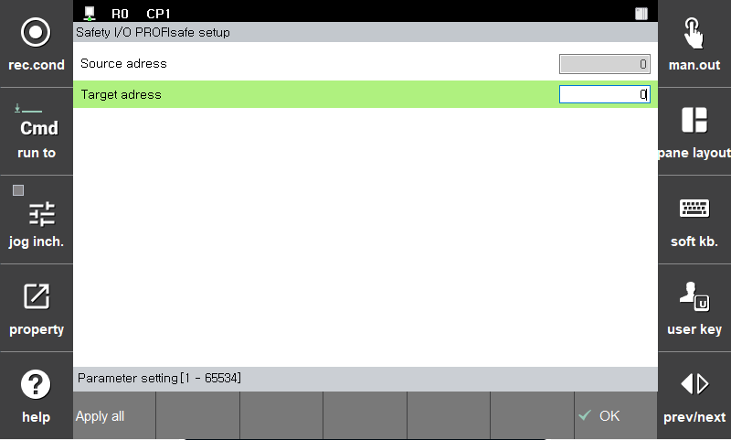



# 3.3.3.5 PROFIsafe

*1. PROFIsafe设置**

- Source Address：设置Source Address。（固定为1）
- Destination Address：设置Destination Address。（设置范围：1 ~ 65534）
 
*2. 参考事项**
  
- Address Type：Address Type 1（仅勾选Destination Address）
- Reaction on Device_Fault：当该装置处于Fault状态时，所有F-Output输出都会变更为Fail-safe（0）状态。而且，该装置的Fault状态解除后，需要在F-Host使用Global-Acknowledge等指令对F-Device进行re-integration的过程。
 
*3. 报警列表**

|Alarm No.|Alarm Decsription  |
|--|--|
| 0x10 |参数设置错误 |
| 0x13 |通信错误 |
| 0x19 |安全功能错误 |
| 0x1C |内部通信错误1 |
| 0x1D |内部通信错误2 |
| 0x1E |内部通信错误3 |
| 0x40 |F-Dest Address设置错误 |
| 0x41 |F-Dest Address值无效 |
| 0x42 |F-Src Address设置错误 |
| 0x43 |F-Watchdog值无效 |
| 0x45 |F-CRC长度异常 |
| 0x46 |F-PAR版本异常 |
| 0x47 |CRC1异常 |
| 0x4C |F-Block ID异常 |
| 0x4D |CRC2异常 |
| 0x4E |F-Watchdog超时 |

> 以下由TP进行的参数设置正在准备中。

- Source Address：设置Source Address。（固定为1）
- Destination Address：设置Destination Address。（设置范围：1 ~ 65534）
