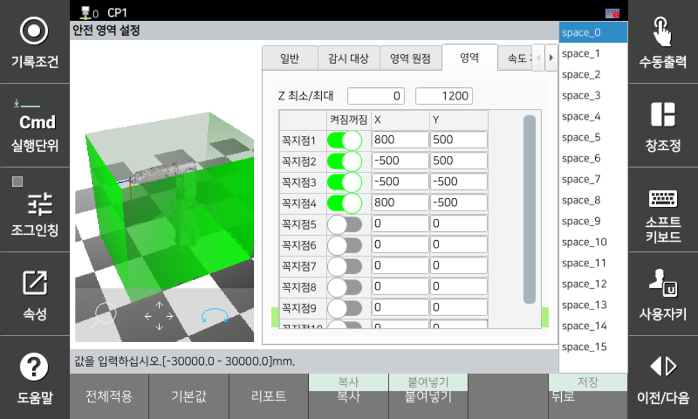
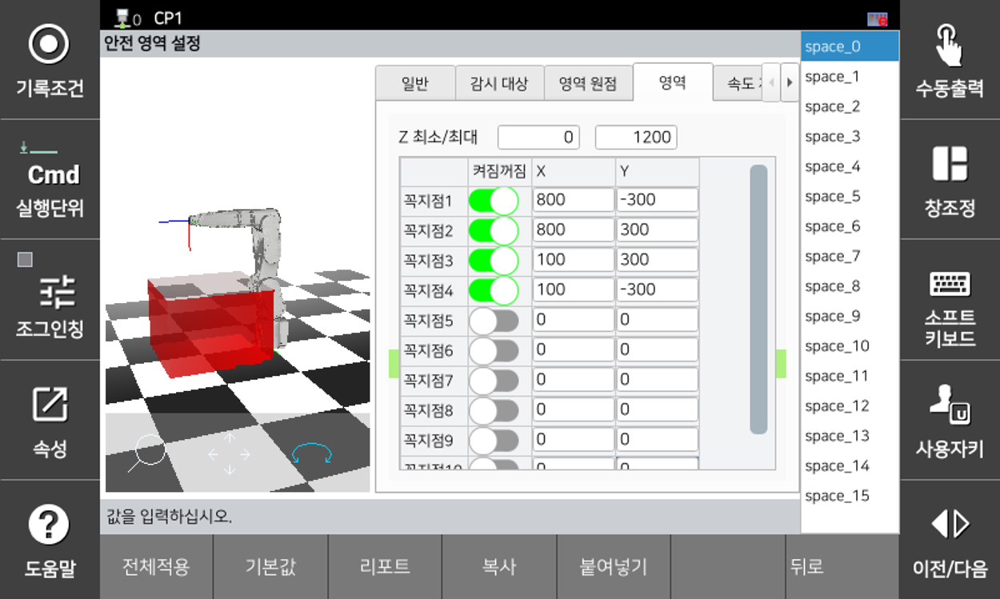
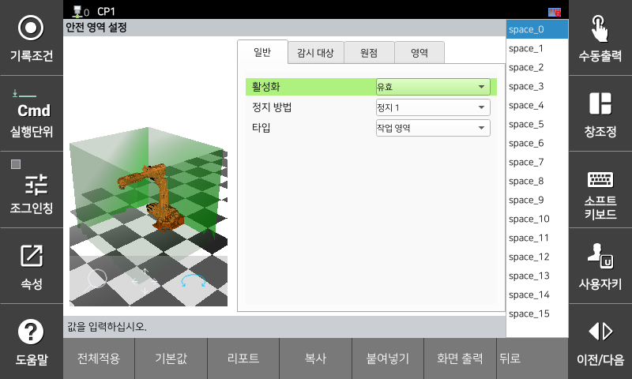
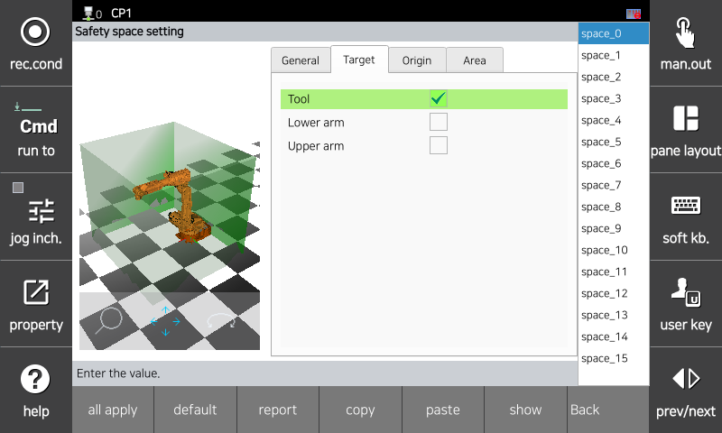

# 3.3.3.1 안전 영역 설정

안전 영역은 툴 및 로봇 링크 영역을 모니터링하기 위한 작업 공간 또는 보호 공간입니다. 작업 공간은 모니터링 대상이 자유롭게 움직일 수 있지만 떠날 수는 없는 제한된 공간입니다. 이와 달리, 보호 공간은 모니터링 대상이 진입하면 움직일 수 없는 제한된 공간입니다. 로봇이 설정한 작업 공간을 벗어나거나, 보호 공간을 침범할 경우 안전 정지(정지 0, 정지 , 정지 2)가 활성화됩니다.

</img>
<em>
작업 공간
</em>

</img>
<em>
보호 공간
</em>

안전 영역은 로봇 좌표계를 기준으로 각 꼭지점의 위치와 높이를 설정하여 공간을 구성합니다. 꼭지점은 최대 10 개까지 추가할 수 있습니다. 안전 공간은 파라미터 설정 또는 안전 입출력 신호에 의해 활성화됩니다.

안전 영역은 `[시스템 > 8: 안전 시스템 > 2: 파라미터 설정 > 2: 영역 제한 > 1: 영역]` 메뉴의 각 탭에서 파라미터값을 설정할 수 있습니다.

*   **일반** 

</img>
<em>
일반
</em>

|  **파라미터** |                       **설명**                       |  **기본 설정값**  |
| :-------: | :------------------------------------------------: | :----------: |
| 활성화 | 
기능 활성화 여부

(무효 / 유효 / 안전 입출력)
 | 무효 |
| 정지 방법 |   
기능 위반시 정지 방법

(정지 0 / 정지 1 / 정지 2 / 무정지)
  | 정지 1 |
| 타입 |  
안전영역의 종류

(작업 영역 / 보호 영역)
  | 작업 영역 |

*   **감지 대상** 

</img>
<em>
감지 대상
</em>

|  **파라미터** |                       **설명**                       |  **기본 설정값**  |
| :-------: | :------------------------------------------------: | :----------: |
| 툴 | 
툴 모델링 감시

(꺼짐 / 켜짐)
 | 꺼짐 |
| 하부 암 |  
로봇 2축 모델링 감시

(꺼짐 / 켜짐)
  | 꺼짐 |
| 상부 암 |  
로봇 3축 모델링 감시

(꺼짐 / 켜짐)
  | 꺼짐 |

*   **영역** 

</img>
<em>
영역
</em>

|  **파라미터** |                       **설명**                       |  **기본 설정값**  |
| :-------: | :------------------------------------------------: | :----------: |
| 
Z 최소 / 최대

[mm]
 | 
로봇좌표계 기준 안전 영역의 높이

(-5000.0 ~ 5000.0)
 |   0  |
| 활성화 |   
안전 영역의 꼭지점 활성화 여부

(활성화 / 비활성화)
  | 비활성화 |
| 
X

[mm]
 |  
로봇좌표계 기준 꼭지점의 X방향 위치

(-5000.0 ~ 5000.0)
  | 0 |
| 
Y

[mm]
 |  
로봇좌표계 기준 꼭지점의 Y방향 위치

(-5000.0 ~ 5000.0)
  | 0 |


**\[주의]**: 안전기능은 설정한 영역을 기반으로 감시합니다. 설정한 영역이 정지거리를 감안하여 설정해야 하며, 구동 전 반드시 검증을 수행해야합니다.
