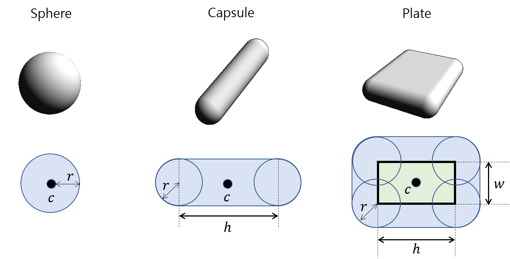
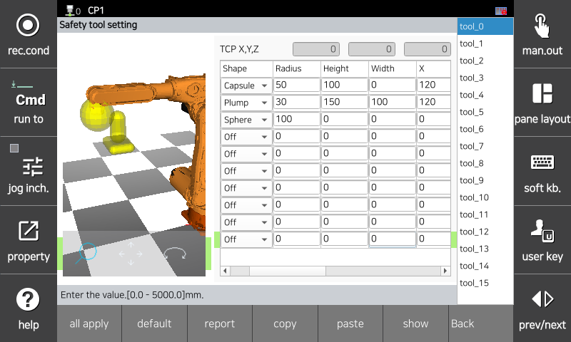

# 3.3.2.2 Safety Tool Modeling

Monitors whether the sphere modeled with a tool used for safety area monitoring violates the protected space or leaves the work space. Up to 16 safety tools can be set and modeled with up to 10 models.

As the safety tool is activated by the tool number set on the teach pendant, you should model the safety tool based on the tool data set in the `[System > 3: Robot Parameters > 1: Tool Data]` menu. Refer to the TCP position information at the top of the tool data setting screen.

There are a total of 3 models used for safety tool modeling: sphere, capsule, and plate. Each model consists of a center and radius. The center position and radius of the modeling are set based on the robot flange coordinate system (Xf, Yf, and Zf), and the radius is set to include the tool size and stop distance at maximum TCP speed.

</img>
<em>
Tool modeling
</em>

|  **Parameter** |                       **Description**                       |  **shape**  |
| :-------: | :------------------------------------------------: | :----------: |
| c | center(X,Y,Z based robot flange coordinate system) |   sphere, capsule, plate  |
| r | radius  |   sphere, capsule, plate  |
| h | height  |   capsule, plate  |
| w | width  |   plate  |

</img>
<em>
Robot flange coordinate system
</em>

You can set parameter values   in the `[System > 8: Safety System > 2: Parameter Setting > 2: Area Limit > 3: Tool Modeling]` menu.

</img>
<em>
Safety Tool Modeling Settings Screen
</em>

|  **Parameter** |                       **Description**                       |  **Default Setting**  |
| :-------: | :------------------------------------------------: | :----------: |
| TCP X,Y,Z | 
TCP position in flange coordinate system (read-only) - set in tool info
 | 0 |
| Geometry | 
Tool modeling shape

(off / sphere / capsule / plate)
 | off |
| 
Radius

[mm]
 | 
Radius

(0.0 ~ 3000.0)
 | 0 |
| 
Height

[mm]
 | 
Height of plate

(0.0 ~ 5000.0)
 | 0 |
| 
Width

[mm]
 | 
Width of plate

(0.0 ~ 5000.0)
 | 0 |
| 
X

[mm]
 | 
Model center position in X direction

(-5000.0 ~ 5000.0)
 | 0 |
| 
Y

[mm]
 | 
Model center position in Y direction

(-5000.0 ~ 5000.0)
 | 0 |
| 
Z

[mm]
 | 
Model center position in Z direction

(-5000.0 ~ 5000.0)
 | 0 |
| 
Rot.X

[deg]
 | 
X direction in flange coordinate system

(-180.0 ~ 180.0)
 | 0 |
| 
Rot.Y

[deg]
 | 
Y direction in flange coordinate system

(-180.0 ~ 180.0)
 | 0 |
| 
Rot.Z

[deg]
 | 
Z direction in flange coordinate system

(-180.0 ~ 180.0)
 | 0 |


**\[Caution]**

* When changing tool data, be sure to recheck that the parameters set in safety tool modeling are accurate. The tool data number and safety tool modeling number of the same tool should match.
* As the definition of robot layout settings applies only to the robot 2nd and 3rd axes, other parts of the robot may violate this area even if a safety area is set.

