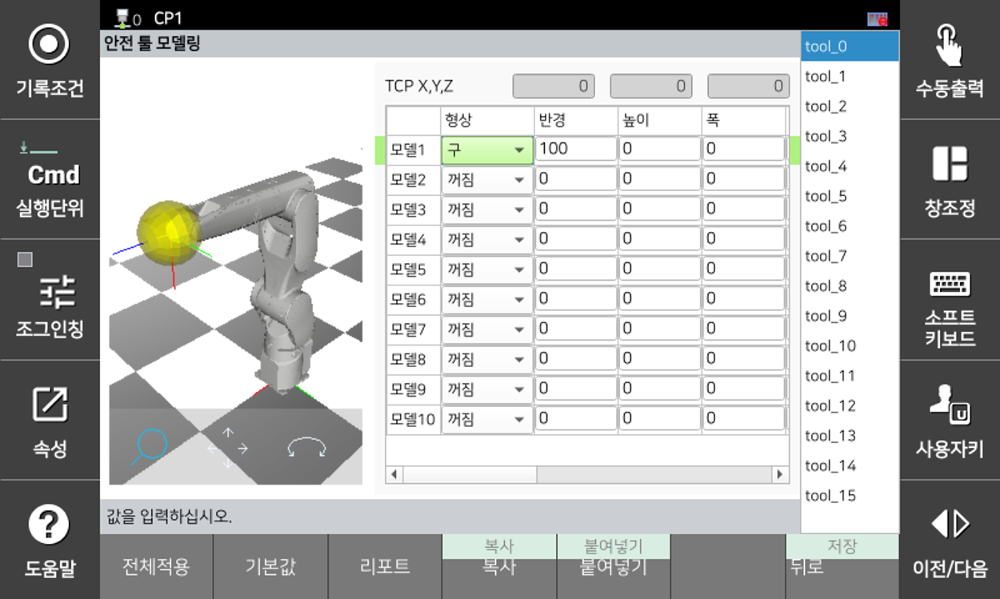

# 3.3.2.2 Sicherheitswerkzeugmodellierung

Überwacht, ob die als Werkzeug für die Sicherheitszonenüberwachung modellierte Kugel den geschützten Bereich verletzt oder den Arbeitsbereich verlässt. Es können bis zu 16 Sicherheitswerkzeuge eingestellt und mit bis zu 10 Modellen modelliert werden.

Da das Sicherheitswerkzeug über die am Teach-Pendant eingestellte Werkzeugnummer aktiviert wird, müssen Sie das Sicherheitswerkzeug basierend auf den im Menü \[System > 3: Roboterparameter > 1: Werkzeugdaten] eingestellten Werkzeugdaten modellieren. Beziehen Sie sich auf die TCP-Positionsinformationen oben im Bildschirm für die Werkzeugdateneinstellungen.

Es gibt insgesamt drei Modelle für die Sicherheitswerkzeugmodellierung: Kugel, Kapsel und Platte. Jedes Modell besteht aus einem Mittelpunkt und einem Radius. Die Mittelpunktposition und der Radius der Modellierung werden basierend auf dem Roboterflansch-Koordinatensystem (Xf, Yf, Zf) festgelegt, und der Radius wird so eingestellt, dass er die Werkzeuggröße und den Stoppweg bei maximaler TCP-Geschwindigkeit umfasst.

</img>
<em>
Werkzeugmodellierung
</em>

</img>
<em>
Roboterflansch-Koordinatensystem
</em>

Sie können Parameterwerte im Menü **\[System > 8: Sicherheitssystem > 2: Parametereinstellung > 2: Bereichsbegrenzung > 3: Werkzeugmodellierung]** festlegen.

</img>
<em>
Bildschirm für Modellierungseinstellungen für Sicherheitswerkzeuge
</em>

|  **Parameter** |                       **Beschreibung**                       |  **Standardeinstellung**  |
| :-------: | :------------------------------------------------: | :----------: |
| TCP X,Y,Z | 
TCP-Position im Flanschkoordinatensystem (schreibgeschützt) - in Werkzeuginformationen festgelegt
 | 0 |
| Geometrie | 
Werkzeugmodellierungsform

(aus / Kugel / Kapsel / Platte)
 | aus |
| 
Radius

[mm]
 | 
Radius

(0,0 ~ 3000,0)
 | 0 |
| 
Höhe

[mm]
 | 
Plattenhöhe

(0,0 ~ 5000,0)
 | 0 |
| 
Breite

[mm]
 | 
Plattenbreite

(0,0 ~ 5000,0)
 | 0 |
| 
X

[mm]
 | 
Modellmittelpunkt in X-Richtung

(-5000,0 ~ 5000,0)
 | 0 |
| 
Y

[mm]
 | 
Modellmittelpunkt in Y-Richtung

(-5000,0 ~ 5000,0)
 | 0 |
| 
Z

[mm]
 | 
Modellmittelpunkt in Z-Richtung

(-5000,0 ~ 5000,0)
 | 0 |
| 
Rot.X

[deg]
 | 
X-Richtung im Flanschkoordinatensystem

(-180,0 ~ 180,0)
 | 0 |
| 
Rot.Y

[deg]
 | 
Y-Richtung im Flanschkoordinatensystem

(-180,0 ~ 180,0)
 | 0 |
| 
Rot.Z

[deg]
 | 
Z-Richtung im Flanschkoordinatensystem

(-180,0 ~ 180,0)
 | 0 |


**\[Achtung]**

* Achten Sie beim Ändern von Werkzeugdaten darauf, erneut zu überprüfen, ob die in der Sicherheitswerkzeugmodellierung eingestellten Parameter korrekt sind. Die Werkzeugdatennummer und die Sicherheitswerkzeugmodellierungsnummer desselben Werkzeugs müssen übereinstimmen.
* Da die Definition der Roboterlayout-Einstellungen nur für die Roboterachsen 2 und 3 gilt, können andere Teile des Roboters diese Zone verletzen, selbst wenn eine Sicherheitszone festgelegt ist.

