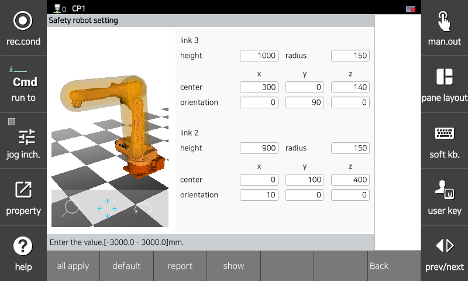

# 3.3.2.3 Safety Robot Modeling

A robot model used for safety space monitoring. Safety robot modeling can be applied to axes 2 and 3, and both are modeled as capsules.

The capsule used for the safety modeling for robots consists of the center and radius of the spheres at both ends. The center of the modeling sphere is the center position of the robot 2nd/3rd axis, and the radius should be large enough to include the size of the current link and the stop distance at the maximum TCP speed.

You can set parameter values   in the `[System > 10: Safety System > 2: Parameter setup > 2: Space restriction > 2: Robot]` menu.

</img>
<em>
Safety Robot Modeling Settings Screen
</em>

| **Parameter** | 　　　　　　　　　**Description**                                     | **Default Setting** |
| :------: | --------------------------------------------------- | :--------: |
| 
Height

[mm]
 | 
Plate height

(0 ~ 5000.0)
 | 0 |
| 
Radius

[mm]
 | 
Radius of sphere

(0 ~ 3000.0)
 | 10 |
| 
Center

[mm]
 | 
Center position

(-3000.0 ~ 3000.0)
 | 0 |
| 
Direction

[deg]
 | 
Orientation of coordinate system

(-180.0 ~ 180.0)
 | 0 |                    |    0 mm    |


**\[Caution]**

* As the definition of robot layout settings applies only to the robot 2nd and 3rd axes, other parts of the robot may violate this area even if a safety area is set.
