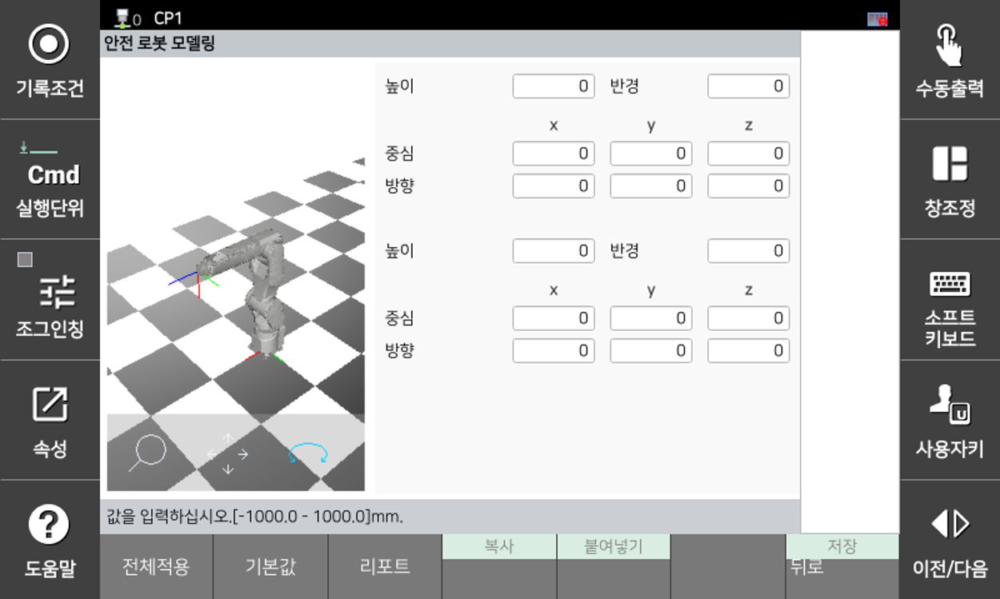

# 3.3.3.3 안전 로봇 모델링

안전 공간 모니터링에 사용하는 로봇 모델입니다. 안전 로봇 모델링은 2축과 3축에 적용할 수 있으며 모두 캡슐로 모델링합니다.

안전 로봇 모델링에 사용되는 캡슐은 양 끝의 구 중심과 반지름으로 구성됩니다. 모델링의 구 중심은 로봇 2축/3축 중심 위치이고 반지름은 현재 링크의 크기 및 최대 TCP 속도에서의 정지 거리를 포함할 수 있을 만큼 커야 합니다.

**\[시스템 > 8: 안전 시스템 > 2: 파라미터 설정 > 2: 영역 제한 > 2: 로봇 모델링]** 메뉴에서 파라미터 값을 설정할 수 있습니다.

</img>
<em>
안전 로봇 모델링 설정 화면
</em>

| **파라미터** | 　　　　　　　　　**설명**                                     | **기본 설정값** |
| :------: | :---------------------------------------------------: | :--------: |
|    
높이

[mm]
    | 
플레이트의 높이

(0 ~ 5000.0)
 |    0    |
|    
반경

[mm]
    | 
구체의 반지름

(0 ~ 3000.0)
 |    10    |
|    
중심

[mm]
    | 
중심 위치

(-3000.0 ~ 3000.0)
 |    0    |
|    
방향

[deg]
   | 
좌표계의 방향

(-180.0 ~ 180.0)
 |    0    |


**\[주의]**

* 로봇 레이아웃 설정의 정의는 로봇 2축과 3축에만 해당되므로 안전 영역을 설정하더라도 로봇의 다른 부분이 이 영역을 침범할 수 있습니다.
