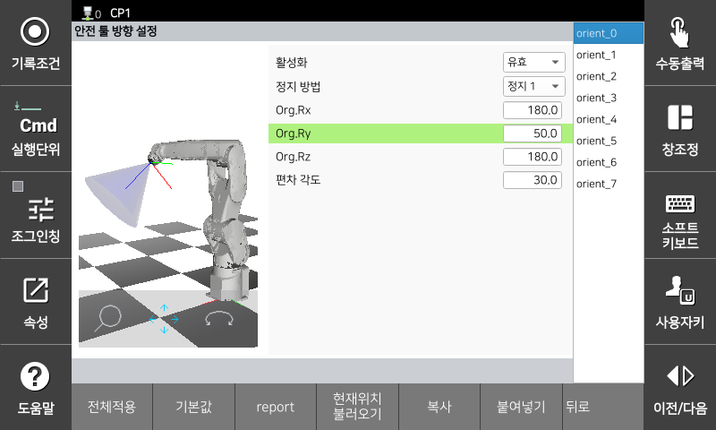

# 3.3.2.4 TCP-Orientierungsüberwachung

Um die TCP-Orientierungsüberwachungsfunktion zu verwenden, können Sie einen Überwachungskegel einrichten, indem Sie den Drehwinkel und den Abweichungswinkel für die Erzeugung des Referenzvektors festlegen.

Durch Festlegen des Referenzvektors () mittels Drehung des Z-Richtungsvektors des Roboterkoordinatensystems () um einen festgelegten Winkel lässt sich ein Kegel () modellieren, der aus durch den Abweichungswinkel () getrennten Mutterlinien besteht. Die Spitze dieses Kegels () befindet sich am TCP. Überschreitet der Z-Richtungsvektor des TCP () den Überwachungskegel, tritt ein Fehler aufgrund einer Verletzung der TCP-Richtungsgrenzfunktion auf.

</img>
<em>
툴 방향 제한 기능
</em>

Die Parameterwerte können Sie im Menü **\[System > 8: Sicherheitssystem > 2: Parametereinstellung > 2: Bereichsbegrenzung > 4: Werkzeugrichtung]** einstellen.

</img>
<em>
툴 방향 설정 화면
</em>

|  **Parameter** |                       **Beschreibung**                       |  **Standardeinstellung**  |
| :-------: | :------------------------------------------------: | :----------: |
| Aktivierung | 
Funktionsstatus

(Ungültig / Gültig / Sichere E/A)
 | Ungültig |
| Stoppmethode | 
Stoppmethode bei Funktionsverletzung

(Stop 0 / Stop 1 / Stop 2 / Kein Stopp)
 | Stop 1 |
| 
Org.Rx

[deg]
 | 
Drehwinkel des Referenzvektors relativ zur X-Richtung

(-180,0 ~ 180,0)
 | 0,0 |
| 
Org.Ry

[deg]
 | 
Drehwinkel des Referenzvektors relativ zur Y-Richtung

(-180,0 ~ 180,0)
 | 0,0 |
| 
Org.Rz

[deg]
 | 
Rotation des Referenzvektors relativ zur Z-Richtung

(-180,0 ~ 180,0)
 | 0,0 |
| Abweichungswinkel | 
Werkzeugorientierungsgrenze

(-180,0 ~ 180,0)
 | 0,0 |
| Aktuelle Position laden   | Referenzvektor mit aktueller Roboterposition erstellen | - |


**\[Achtung]**

* Achten Sie beim Ändern von Werkzeugdaten darauf, erneut zu überprüfen, ob die in der Sicherheitswerkzeugmodellierung eingestellten Parameter korrekt sind. Die Werkzeugdatennummer und die Sicherheitswerkzeugmodellierungsnummer desselben Werkzeugs müssen übereinstimmen.

