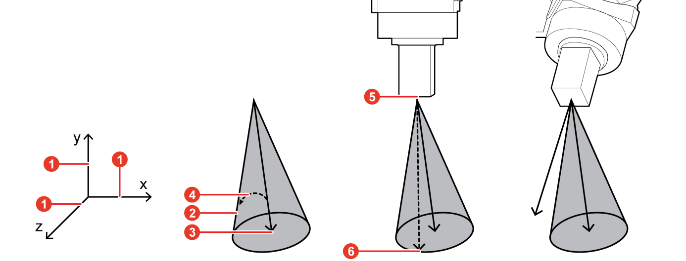
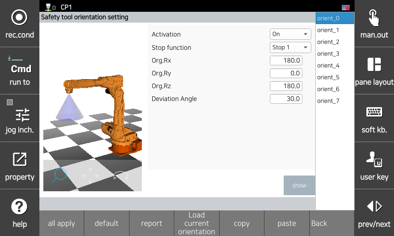

# 3.3.3.4 TCP方向监控

要使用TCP方向监控功能，可以通过设置参考向量的旋转角度和偏差角度来建立监控锥。

通过基于参考向量()旋转机器人坐标系的Z方向向量()设定角度，可以建模一个由偏差角()分隔的母线组成的锥()。这样一个锥的顶点()位于TCP处，如果TCP的Z方向向量()穿过监控锥，则会发生TCP方向限制功能违反错误。

</img>
<em>
TCP方向监控
</em>

您可以在`[System > 10: Safety System > 2: Parameter setup > 2: Space restriction > 4: Tool orientation]`菜单中设置参数值。

</img>
<em>
TCP方向参数设置屏幕
</em>

|  **参数** |                       **描述**                       |  **默认设置**  |
| :-------: | :------------------------------------------------: | :----------: |
| 激活 | 
功能是否被激活

(无效 / 有效 / 安全 I/O)
 | 无效 |
| 停止方法 | 
功能违反时的停止方法

(停机 0 / 停机 1 / 停机 2 / 不停止)
 | 停机 1 |
| 
Org.Rx

[度]
 | 
参考向量相对于X方向的旋转量

(-180.0 ~ 180.0)
 | 0.0 |
| 
Org.Ry

[度]
 | 
参考向量相对于Y方向的旋转量

(-180.0 ~ 180.0)
 | 0.0 |
| 
Org.Rz

[度]
 | 
参考向量相对于Z方向的旋转量

(-180.0 ~ 180.0)
 | 0.0 |
| 偏差角 | 
工具方向限制

(1.0 ~ 179.9)
 | 0.0 |
| 负载当前位置   | 使用当前机器人姿势创建参考向量 | - |


**\[注意]**

* 更改工具数据时，请确保重新检查安全工具建模中设置的参数是否准确。同一工具的工具数据编号和安全工具建模编号应匹配。
