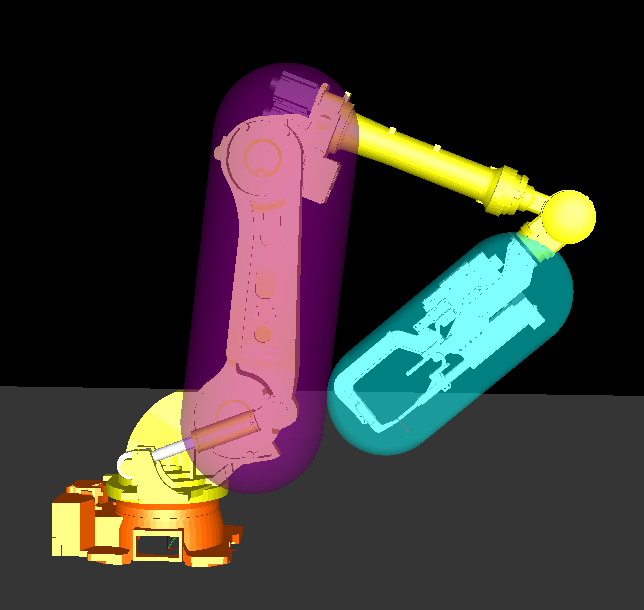
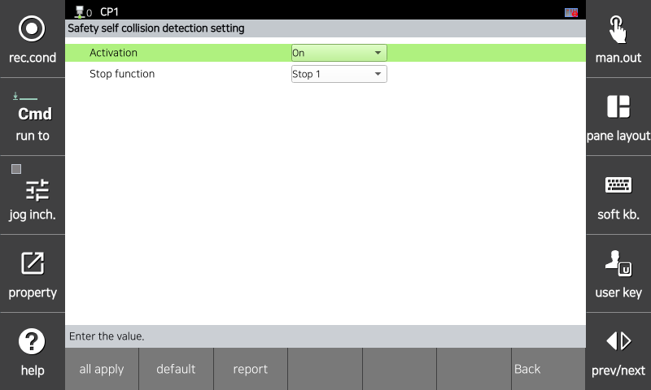

# 3.3.3.5 Self-Collision Detection

Self-collision detection is a function that monitors potential collisions between Axis 2 of the robot and the tool.
The tool and the robot must be modeled to match their actual geometries.
For detailed information on the modeling methods, refer to "[3.3.3.2 Safety Tool Modeling](../../../3-safety-function/3-safety-function/3-safety-layout/2-safety-tool-modeling.md)" and "[3.3.3.3 Safety Robot Modeling](../../../3-safety-function/3-safety-function/3-safety-layout/3-safety-robot-modeling.md)".

</img>
<em>
Self-Collision Detection
</em>

You can set parameters for the robot's self-collision detection function in the `[System > 8: Safety System > 2: Parameter Settings > 2: Area Limits > 5: Self-Collision Detection]` menu.

</img>
<em>
Self-collision detection function parameter setting screen
</em>

|  **Parameter** |                       **Description**                       |  **Default Setting**  |
| :-------: | :------------------------------------------------: | :----------: |
| Activation | 
Whether the function is activated

(Invalid / Valid / Safe I/O)
 | Invalid |
| Stop method | 
Stop method when the function is violated

(Stop 0 / Stop 1 / Stop 2 / No stop)
 | Stop 1 |

