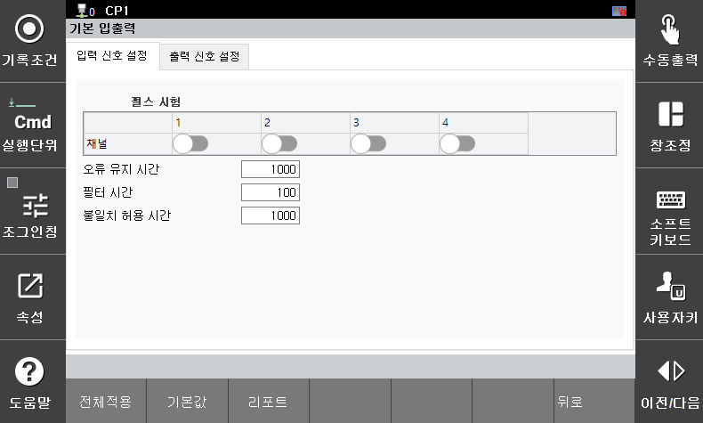
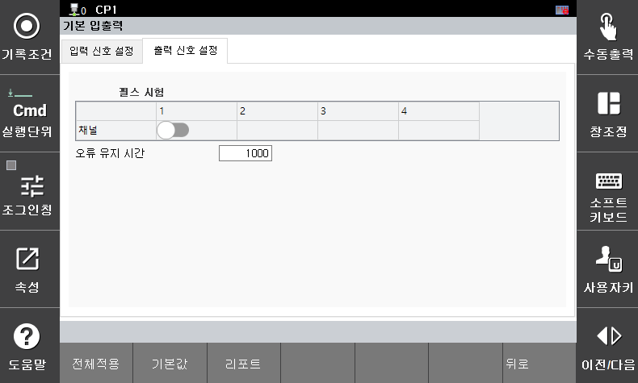
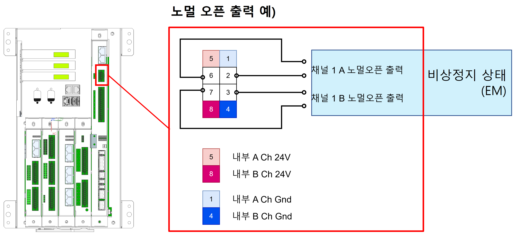

# 3.3.4.1 기본 안전 입출력 신호

안전 입출력 신호의 파라미터를 설정합니다.  
입력 신호는 4개, 출력 신호는 1개이며 모두 이중 신호로 동작합니다.
**\[시스템 > 8: 안전 시스템 > 2: 파라미터 설정 > 3: 안전 입출력 > 2: 기본 입출력]** 메뉴에서 파라미터 값을 설정할 수 있습니다. 

## 1. 입력 신호 설정

</img>
<em>
기본 입출력 설정 화면(입력)
</em>

| 파라미터  [단위]          | 설명                                                                                                                                       | 입력 범위       | 기본 값 |
|:------------------------:|:----------------------------------------------------------------------------------------------------------------------------------:|:--------------:|:------:|
| 펄스 시험                 | 각 채널의 펄스 시험 사용 여부를 설정합니다.                                                                                                     | 활성화 / 비활성화 | 비활성화 |
| 오류 유지 시간  [msec] | 각 채널은 에러가 발생한 후 해당 에러가 해소되더라도, **오류 유지 시간**이 경과한 이후에야 Fail-Safe 상태에서 현재 입력 상태로 전환됩니다. 5로 나누어 떨어지는 값만 입력 가능합니다. | 0 ~ 65530      | 1000   |
| 필터 시간  [msec]      | 각 채널별로 설정된 **필터 시간** 동안 동일한 신호가 입력되어야 유효한 신호로 처리됩니다. 5로 나누어 떨어지는 값만 입력 가능합니다.                       | 0 ~ 500        | 100    |
| 불일치 허용 시간  [msec] | 기본 입력 신호는 두 개의 이중 신호가 동일할 때 유효한 신호로 처리됩니다. 두 신호가 설정된 **불일치 허용 시간** 이상 서로 다르면 알람이 발생합니다. 5로 나누어 떨어지는 값만 입력 가능합니다. | 0 ~ 5000       | 1000   |

### 배선 예)

## 2. 출력 신호 설정

</img>
<em>
기본 입출력 설정 화면(출력)
</em>

| 파라미터  [단위]          | 설명                                                                                                                                       | 입력 범위       | 기본 값 |
|:------------------------:|:----------------------------------------------------------------------------------------------------------------------------------:|:--------------:|:------:|
| 펄스 시험                 | 각 채널의 펄스 시험 사용 여부를 설정합니다.                                                                                                     | 활성화 / 비활성화 | 비활성화 |
| 오류 유지 시간  [msec] | 각 채널은 에러가 발생한 후 해당 에러가 해소되더라도, **오류 유지 시간**동안 **Open (Fail-safe)** 상태를 유지합니다. 이후 정상 출력으로 전환됩니다. 5로 나누어 떨어지는 값만 입력 가능합니다. | 0 ~ 65530      | 1000   |

### 배선 예)

