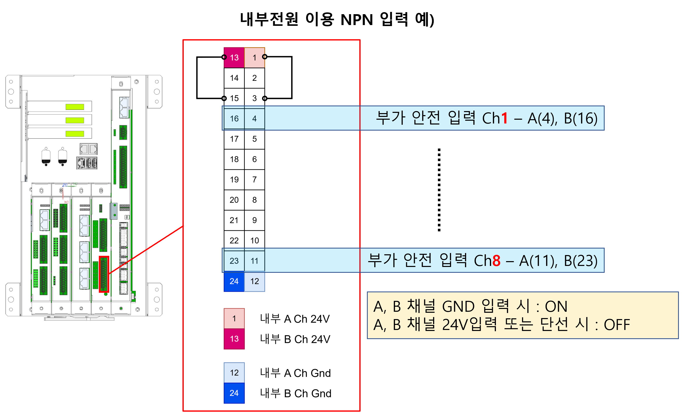
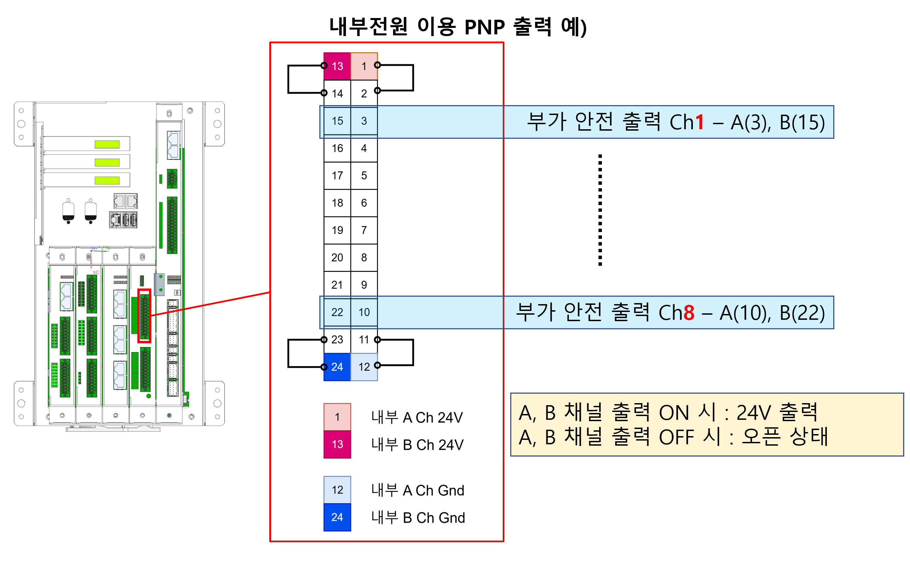

# 3.3.4.2 부가 안전 입출력 신호

부가 안전 입출력 신호의 파라미터를 설정합니다. 입력 신호 8개, 출력 신호 8개로 구성되며 모두 이중신호로 동작 됩니다. 
`[시스템 > 10: 안전 시스템 > 2: 파라미터 설정 > 3: 안전 입출력 > 3: 확장 입출력]` 메뉴에서 파라미터 값을 설정할 수 있습니다. 

### 1) 부가 안전 입출력 신호

</img>
<em>
부가 안전 입출력 설정 화면
</em>

| 파라미터 [단위]             | 설명                                                                                                                                       | 입력 범위       | 기본 값 |
|:---------------------------:|:----------------------------------------------------------------------------------------------------------------------------------------:|:--------------:|:------:|
| 필터 시간  [msec]          | 각 입력 채널별로 **필터 시간** 동안 일정한 신호가 입력되어야 유효한 신호로 처리됩니다. | 0 ~ 500        | 100    |
| 불일치 허용 시간  [msec]     | 확장 안전 입출력은 2개의 이중 신호가 같은 값일 때 유효한 신호로 처리됩니다. 이 2개의 신호가 **불일치 허용 시간**보다 큰 시간 동안 다르면 알람이 발생합니다.| 0 ~ 5000       | 1000   |
| 입력 오류 유지 시간  [msec] | 각 채널은 에러가 발생한 후 해소되더라도, 설정된 시간이 지난 후에야 Fail-Safe 상태에서 현재 입력 상태로 전환됩니다. | 0 ~ 65530      | 1000   |
| 출력 오류 유지 시간  [msec] | 각 채널은 에러가 발생한 후 해소되더라도, 설정된 시간 동안 **Open (Fail-safe)** 상태를 유지합니다. 이후 정상 출력으로 전환됩니다.| 0 ~ 65530      | 1000   |
 
#### 부가 안전 입력 배선 예)

#### 부가 안전 출력 배선 예)

