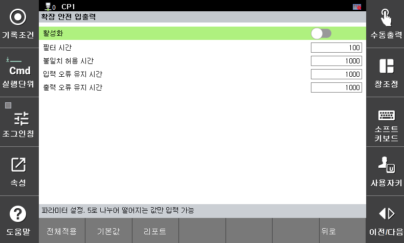

# 3.3.4.2 Extended Safety Input/Output Signals

Set the parameters for additional safety input/output signals. It consists of 8 input signals and 8 output signals, all operating as dual signals.
You can set parameter values in the `[System > 10: Safety System > 2: Parameter setup > 3: Safety I/O > 3: Additional I/O]` menu. 

### 1) Additional Safety Input/Output Signals

</img>
<em>
Extended Input/Output Settings Screen
</em>

| Parameter [Unit]             | Description                                                                                                                                       | Input Range       | Default |
|:---------------------------:|:----------------------------------------------------------------------------------------------------------------------------------------:|:--------------:|:------:|
| Enable                       | Set whether to enable or disable the extended safety input/output signals.                                                                                       | Enable / Disable | Disable |
| Filter Time  [msec]          | For each input channel, constant signals should be input during the **Filter Time** for the signals to be processed as valid signals. Only values divisible by 10 can be entered.                           | 0-500        | 100    |
| Discrepancy Time  [msec]     | Extended safety input/output signals are processed as valid signals when two dual signals have the same value. An alarm is triggered if the two signals are different from each other for longer than the **Discrepancy Time**. Only values divisible by 10 can be entered. | 0-5000       | 1000   |
| Input Error Latch Time  [msec] | When an error occurs in a channel, even if the error is resolved, the system transitions from the Fail-Safe state to the current input state only after the set time has elapsed. Only values divisible by 10 can be entered.             | 0-65530      | 1000   |
| Output Error Latch Time  [msec] | When an error occurs in a channel, even if the error is resolved, the system maintains the **Open (Fail-safe)** state during the set time. After that, it transitions to normal output. Only values divisible by 10 can be entered.   | 0-65530      | 1000   |

#### Additional Safety Input Wiring Example)

#### Additional Safety Output Wiring Example)

