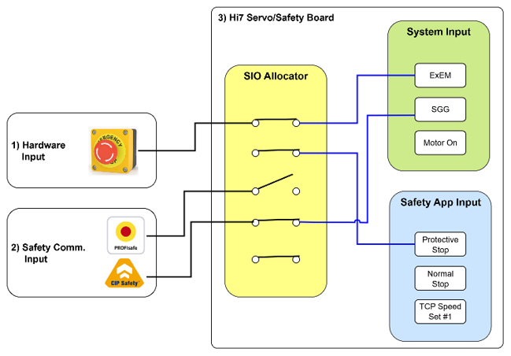
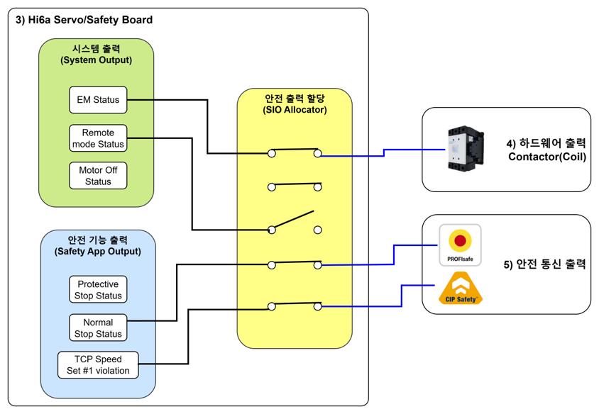
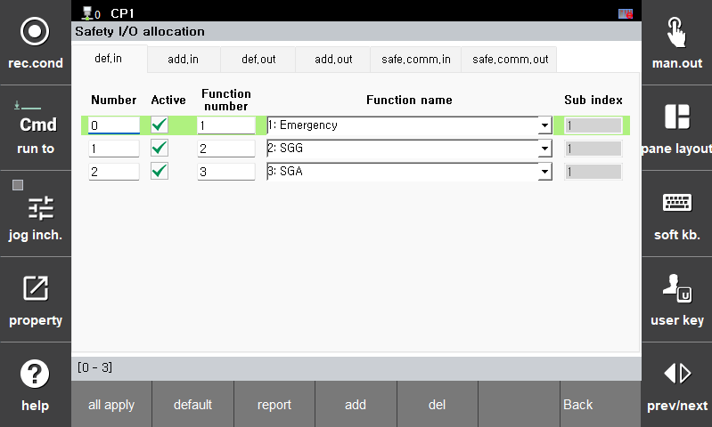

# 3.3.4.3 Safety Signal Assignment

The Safety signal assignment function serves to connect external signals such as safety input/output, additional safety input/output, and safety communication input/output with various logical signals (system safety input/output, safety application signals) that the robot controller has.
You can set the parameter values in the **\[System > 8: Safety System > 2: Parameter Settings > 3: Safety I/O > 1: I/O Allocation]** menu.

-------------------------------------------------------------------------

### Adding Safety Signal Assignment
1) Press the [Add] button.
2) Select the desired function from the function list.
3) If a sub-index is required, enter the sub-index number.

</img>
<em>
Safety Signal Assignment Settings Screen
</em>


* An individual input function item can only be connected to a single input channel. 
* "Basic Safety Input", "Additional Safety Input", and "Safety Communication Input" cannot be assigned in duplication mutually. 
* If duplicate input settings are made, the "E52030 (x ch) Safety input assignment duplication" error occurs.



### Deleting Safety Signal Assignment
1) Select an already set assignment function on the list.
2) Press the **[del]** button.

---

### Default values for safety signals

|  **Channel** |     **Function**                       | 
| :-------: | :------------------------------------------------: |
| Safety Input Channel 1 | External Emergency Stop Input (Emergency) |
| Safety Input Channel 2 | Safety Guard General Input (SGG)|
| Safety Input Channel 3 | Safety Guard Auto Input (SGA)|
| Safety Input Channel 4 | - |
| Safety Output Channel 1 | Emergency Stop Activation Status|

### Safety Input Signal Function List

|  **Channel** |     **Function**                       |       **Description**    |
| :-------: | :--------------------------: | :--------------------------------------------------: |
| Emergency | External Emergency Stop Input| OPEN: Emergency stop activated CLOSE: Emergency stop released |
| SGG| Safety Guard General Input| OPEN: Guard open (Danger)  CLOSE: Guard closed (Safe) |
| SGA | Safety Guard Auto Input| OPEN: Guard open (Danger)  CLOSE: Guard closed (Safe) |
| Protective stop | Protective Stop Input | OPEN: Protective stop activated  CLOSE: Protective stop released |
| Normal stop | Normal Stop Input | OPEN: Normal stop activated  CLOSE: Normal stop released |
| Enable Switch | External Enabling Switch | OPEN: Switch released  CLOSE: Operation possible (Motor On attempt) |
| Motor On | External Motor On | Motor On attempted on Rising Edge |
| Remote | External Mode Input (Remote) | OPEN: Mode change by internal mode signal  CLOSE: Mode change by external mode input signal
| Manual | External Mode Input (Manual)  | OPEN: No operation  CLOSE: External manual mode input |
| Auto | External Mode Input (Auto)  | OPEN: No operation  CLOSE: External auto mode input |
| Arm Limit | Arm Limit Input| OPEN: Limit signal input (Danger)  CLOSE: Limit signal closed (Safe) |
| Primary axis Limit | Primary Axis Limit Input | OPEN: Limit signal input (Danger)  CLOSE: Limit signal closed (Safe) |
| Additional axis Limit | Additional Axis Limit Input | OPEN: Limit signal input (Danger)  CLOSE: Limit signal closed (Safe) |
| External axis Limit | External Axis Limit Input | OPEN: Limit signal input (Danger)  CLOSE: Limit signal closed (Safe) |
| Monitored standstill #1-#8 | Monitored Standstill (sos_0-sos_7) | OPEN: Function activated CLOSE: Function deactivated |
| Joint speed set #1-#8 | Joint Speed (speed_0-speed_7) | OPEN: Function activated CLOSE: Function deactivated |
| TCP speed set #1-#16 | TCP Speed (speed_0-speed_15) | OPEN: Function activated CLOSE: Function deactivated |
| Joint angle #1-#8 | Joint Space (space_0-space7) | OPEN: Function activated CLOSE: Function deactivated |
| TCP position(space) #1-#16 | TCP Space (space_0-space15) | OPEN: Function activated CLOSE: Function deactivated |
| TCP orientation #1-#8 | Tool Orientation (orient_0-orient7) | OPEN: Function activated CLOSE: Function deactivated |
| Self collision | Self Collision | OPEN: Function activated CLOSE: Function deactivated |
| Power #1-#16 | Power (power_0-power_15) | OPEN: Function activated CLOSE: Function deactivated |
| Momentum #1-#16 | Momentum (mmt_0-mmt_15) | OPEN: Function activated CLOSE: Function deactivated |
| Collision detection #1-#16 | Collision Detection (coldet_0-coldet_15) | OPEN: Function activated CLOSE: Function deactivated |
| Speed & separation #1-#84 | RePlan | OPEN: Function activated CLOSE: Function deactivated |
| Mastering test switch | Mastering Test Switch | OPEN: Function activated CLOSE: Function deactivated |

### Safety Output Signal Function List
|  **Channel** |     **Function**                       |       **Description**    |
| :-------: | :--------------------------: |  :--------------------------------------------------: |
| Emergency stop activation status | Emergency Stop Status | OPEN: At least one of TP, OP, and external emergency stop is pressed   CLOSE: None of TP, OP, and external emergency stop is pressed.  |
| Protective stop activation status | Protective Stop Status | OPEN: Not in protective stop state  CLOSE: In protective stop state |
| Normal stop activation status | Normal Stop Status | OPEN: Not in normal stop state  CLOSE: In normal stop state |
| Remote mode status | External Operation Status | OPEN: Internal operation mode  CLOSE: External operation mode |
| Manual mode status | Manual Mode Status | OPEN: Not in manual mode   CLOSE: In manual mode |
| Auto mode status | Auto Mode Status | OPEN: Not in auto mode   CLOSE: In auto mode|
| Motor Off status | Motor Off Status | OPEN: Motor On state  CLOSE: Motor Off state|
| Safety Function activation status | Safety Function Activation Status | OPEN: Safety function deactivated  CLOSE: Safety function activated |
| Monitored standstill activation status | Safe Operating Stop Monitoring Activation Status | OPEN: Safe Operating Stop monitoring deactivated  CLOSE: Safe Operating Stop monitoring activated |
| Replan activation status | RePlan Activation Status | OPEN: RePlan deactivated  CLOSE: RePlan activated |
| Violation alarm | Safety Function Violation Status | OPEN: Safety function violated  CLOSE: No safety function violation |
| Monitored standstill #1-#8 violation | Safe Operating Stop Violation (sos_0-sos_7) | OPEN: Safe Operating Stop violated  CLOSE: No Safe Operating Stop violation |
| Joint speed set #1-#8 violation | Joint Speed Violation (speed_0-speed_7) | OPEN: Joint speed violated  CLOSE: No joint speed violation |
| TCP speed set #1-#16 violation | TCP Speed Violation (speed_0-speed_15) | OPEN: TCP speed violated  CLOSE: No TCP speed violation |
| Joint angle #1-#8 violation | Joint Space Violation (space_0-space7) | OPEN: Joint space violated  CLOSE: No joint space violation |
| TCP position #1-#16 violation | TCP Space Violation (space_0-space15) | OPEN: TCP space violated  CLOSE: No TCP space violation |
| TCP orientation #1-#8 violation | Tool Orientation (orient_0-orient7) | OPEN: Tool orientation violated  CLOSE: No tool orientation violation |
| Self collision detection | Self Collision Detection| OPEN: Self collision detected  CLOSE: No self collision |
| Power #1-#16 violation | Power Violation (power_0-power_15) | OPEN: Power violated  CLOSE: No power violation |
| Momentum #1-#16 violation | Momentum Violation (mmt_0-mmt_15) | OPEN: Momentum violated  CLOSE: No momentum violation |
| Collision detection #1-#16 violation | Collision Detection  (coldet_0-coldet_15) | OPEN: Collision detected  CLOSE: No collision |
| Mastering test error | Mastering Test Error | OPEN: Mastering test error occurred  CLOSE: No mastering test error |
| Brake test error | Brake Test Error | OPEN: Brake test error occurred  CLOSE: No brake test error |


* Defined as **OPEN = Bit 0**, **CLOSE = Bit 1** in safety communication


