

# 3.3.4.4 PROFIsafe

## 1) PROFIsafe?
- A safety protocol (safety profile) that operates on PROFINET/PROFIBUS.
- Transmits safety data through standard PROFINET communication channels ('Black Channels').
- Supports safety signal transmission without the need for additional wiring.

## 2) PROFINET & PROFIsafe Specifications
- Digital Input: 50, 120, or 240 bytes (Select one)
- Digital Output: 50, 120, or 240 bytes (Select one)
- Safety I/O: 8/8 bytes (Enable or Disable)
- Minimum Communication Cycle: 1 msec
- Supported Communication Speed: 10 or 100 Mbps
- Conformance Class: B
- Netload Class: II
- Optional Features: Legacy, MRP

## 3) PROFIsafe Parameters

`[System > 2: Control Parameters > 11: Industrial Communication > 6: Safety Communication > 2: PROFIsafe]` 

 - Source Address: Sets the Source Address. (Fixed to 1)
 - Target Address: Sets the Target Address. (Setting range: 1 to 65534)
 
 ***Note***  
 - Address Type: Address Type 1 (Only Destination Address is allowed)
 - Reaction on Device_Fault: If this device enters a Fault state, all F-Outputs will change to the Fail-safe (0) state. Once the device's Fault state is resolved, a process of re-integrating the F-Device using a command such as Global-Acknowledge from the F-Host is required.
 

## 4) PROFIsafe Configuration Procedure

1) Connection between BD671 and F-Host & Hi7 Com
2) GSDML File Registration (TIA Portal)
3) PROFIsafe Controller Configuration (TIA Portal)
 3.1) PROFINET Configuration
 3.2) PROFIsafe Configuration
4) Hi7 Configuration (TP UI)
 4.1) PROFINET Configuration
 4.2) PROFIsafe Configuration
5) Verification of PROFINET and PROFIsafe Communication
6) Assignment of PROFINET I/O Signals (FB Block Settings)
7) Assignment of PROFIsafe I/O Signals

### 4.1) Connection between BD671 and F-Host & Hi7 Com

#### 4.1.1) LAN Cable Connection
1) Connect the "PROFIsafe F-Host" and the BD671 using a LAN cable.
2) Verify that the Link LED is flashing.
3) Connect the LAN3 connector of the Hi7 COM and the BD671 using a LAN cable.
4) Verify that the Link LED is flashing.

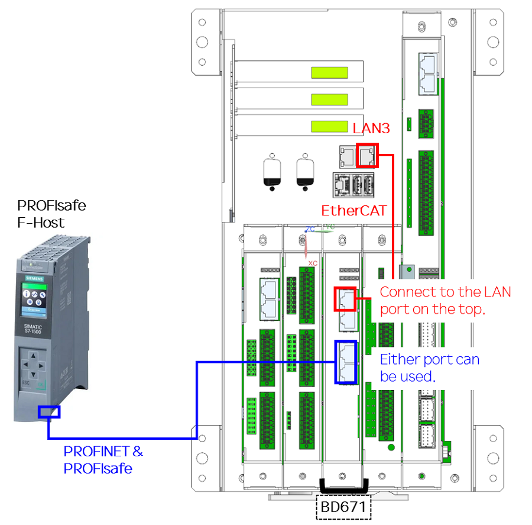

#### 4.1.2) Hi7 Com Connection Settings
1) Navigate to the following menu: **System -> Control Parameters -> Industrial Communication -> EtherCAT Master Settings**
2) Configure the settings as follows:
- EtherCAT Master: ON
- Port: LAN3
3) Select "OptionBD - PROFINET_IO" from the slave list and press the **Apply** button.
4) Reboot the Hi7 robot controller.
5) After rebooting, check the status of the **Run**, **Communication**, and **Error** LEDs.

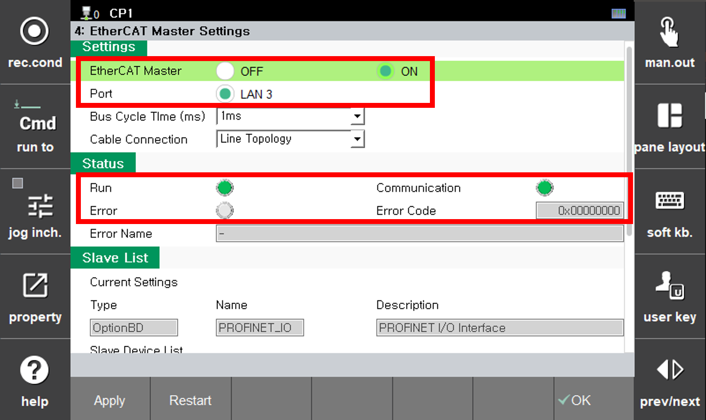
   
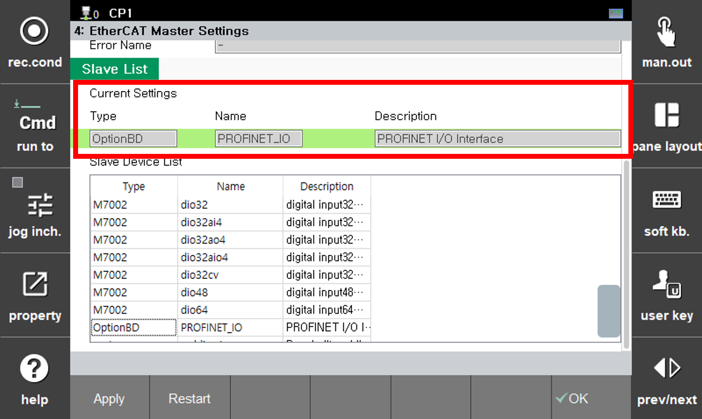

### 4.2) GSDML File Registration (TIA Portal)
1) Launch TIA Portal.
2) Navigate to the menu as shown on the right: **[Options] → [Manage general station description file (GSD)]**.
3) Click the **"..."** button and select the directory where the GSDML file is located.
4) Select **"GSDML-V2.43-Hyundai-Robotics-HI6-20251127.xml"** from the list displayed on the screen and click the **[Install]** button.
5) Verify that the file has been registered as a new device in the Hardware Catalog.  
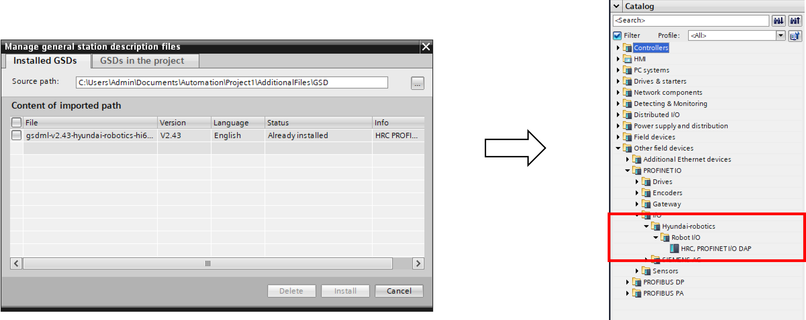

### 4.3) PROFIsafe Controller Configuration (TIA Portal)
#### 4.3.1) PROFINET Configuration
1) Launch TIA Portal and create a new project.
2) Double-click **Devices & Networks** to open it. 
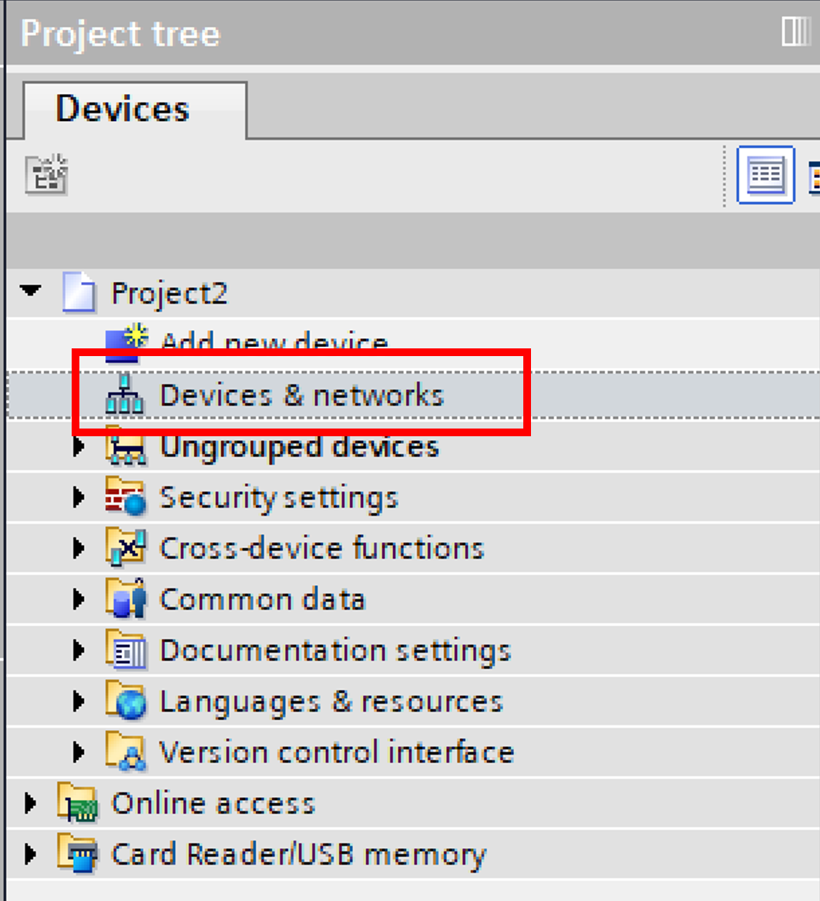

3) Select a controller that supports PROFIsafe communication (e.g., CPU 1511F-1 PN) and drag it into the **Network View**.
4) From the Hardware Catalog, select the device added in the previous step (HRC, PROFINET I/O DAP) and drag it into the **Network View**.
5) Connect the two devices by dragging and dropping between their respective LAN ports in the diagram. 
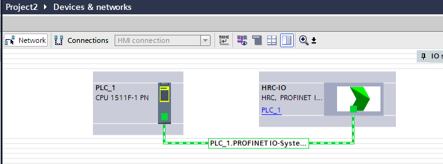

6) Double-click the HRC-IO device in the **"Devices & Networks"** view.
7) Select the desired slot.
8) Drag the desired module (DI, DO, or PROFIsafe I/O) from the catalog on the right and move it to the **"Device Overview"** window. 
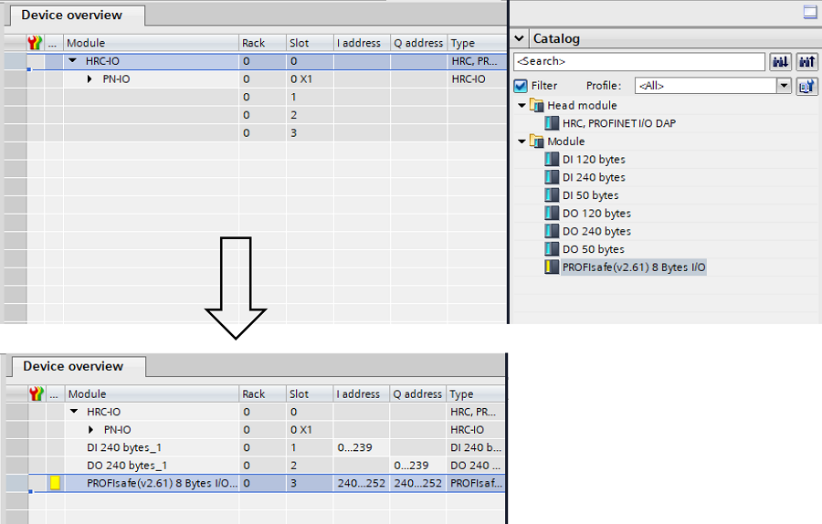

9) Double-click the HRC-IO device in the **"Devices & Networks"** view.
10) Click the HRC-IO device again to open the **Properties** (Settings) window.
11) Navigate to the **General** tab at the bottom.
12) Select **Ethernet addresses** from the menu on the left.
13) Uncheck the **"Generate PROFINET device name automatically"** option.
14) Set the **"PROFINET device name"** to **"hd-hrc-hi7"** and save the changes. 
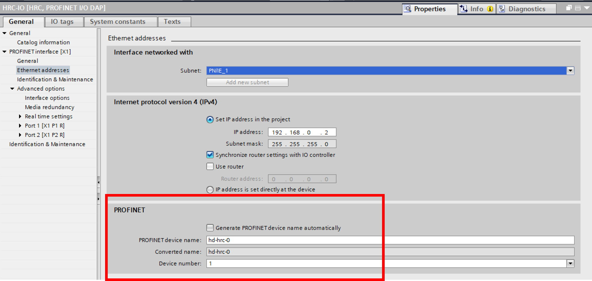

#### 4.3.2) PROFIsafe Configuration
1) Double-click the HRC-IO device in the **"Devices & Networks"** view.
2) Select the PROFIsafe slot in the **"Device Overview"** window on the right.
3) The PROFIsafe communication settings will appear in the bottom pane.
4) Click the **PROFIsafe** tab.
5) Set **F_Dest_Add** to 1. 
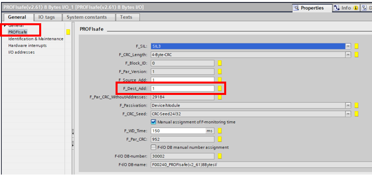

### 4.4) Hi7 Configuration (TP UI)
#### 4.4.1) PROFINET Configuration
1) Configure the parameters with the same values set in the F-Host:
- PROFINET IO Device Name: hd-hrc-hi7
- Slot 1: Digital Input: 240
- Slot 2: Digital Output: 240
- Slot 3: Safety I/O: Selected
2) Press the **"Apply"** button. 
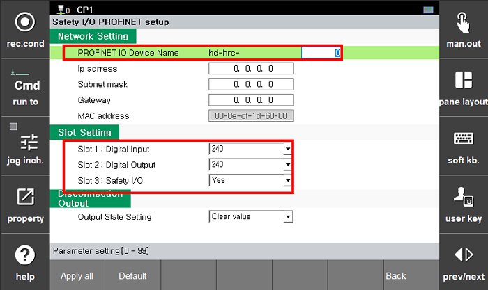

#### 4.4.2) PROFIsafe Configuration

1) Set the **Target Address** to 1, using the same value configured in the previous section.
2) Press the **"Apply"** button. 
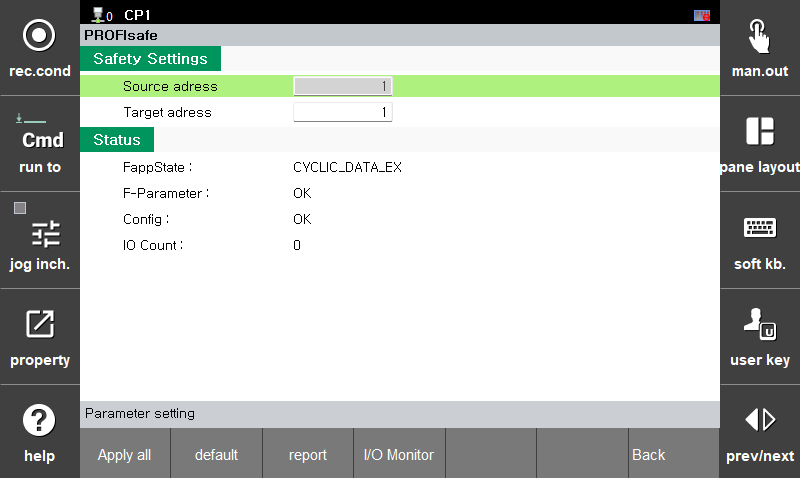

### 4.5) Verification of PROFINET and PROFIsafe Communication

### 4.5.1) Safety Ladder Program (TIA Portal)
1) In the **Device Overview** tab, create a ladder program as shown below and download it to the controller. 
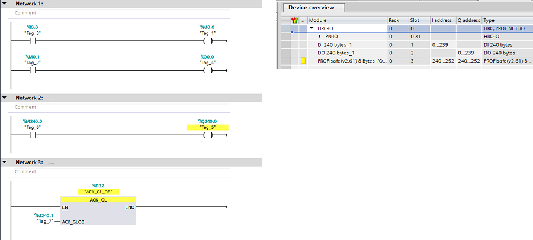
2) After downloading, verify that a green check box is displayed on the **Distributed I/O** screen. 
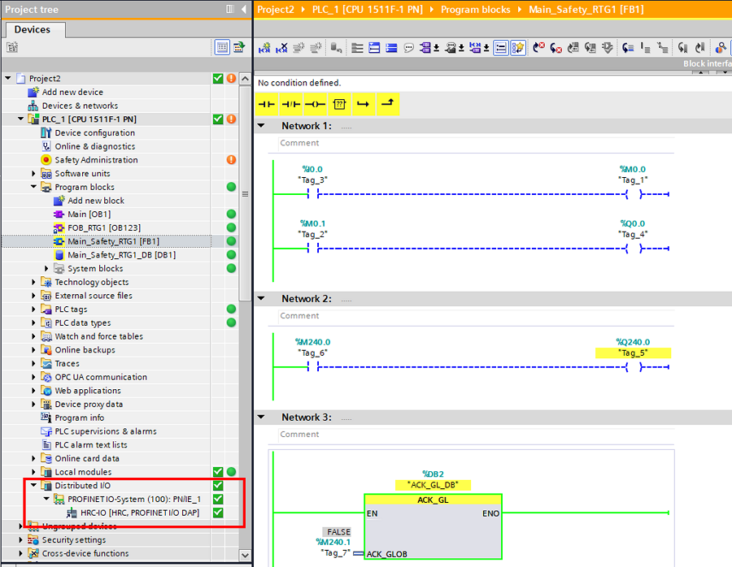

### 4.5.2) TP Screen
1) PROFINET  
Navigate to **System -> 2: Control Parameters -> 11: Industrial Communication -> 5: PROFINET Settings** from the menu. 
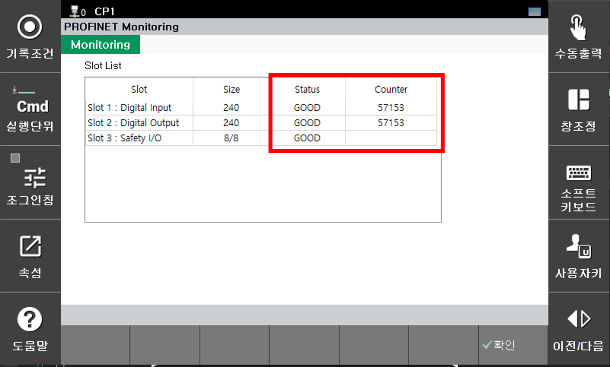
- Check the status information for each slot.
- Verify that the Counter is continuously increasing.

2) PROFIsafe  
Navigate to **System > 2: Control Parameters > 11: Industrial Communication > 6: Safety Communication > 2: PROFIsafe** in the menu. 

- Verify that **FappState** is set to **CYCLE Data EX**.
- Verify that the **Counter** is continuously increasing.

### 4.6) Assignment of PROFINET I/O Signals (FB Block Settings)
1) Navigate to **System → Control Parameters → I/O Signal Settings → FB Block Assignment**.
2) Change the block settings to **PROFINET I/O** as needed, up to a maximum of 2 blocks.
 (The maximum PROFINET I/O size is 240 bytes, and each individual FB block size is 120 bytes. Therefore, **any settings exceeding 2 blocks will be ignored.**) 
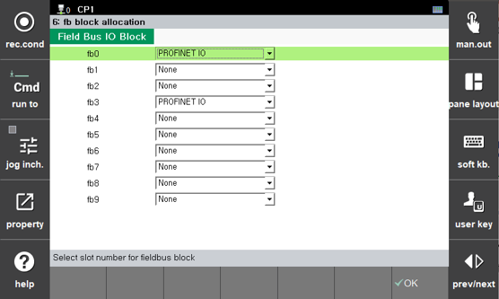

3) Additionally, navigate to the **Condition Settings** menu and verify that the **PLC Operation Mode** is set to **OFF**. 
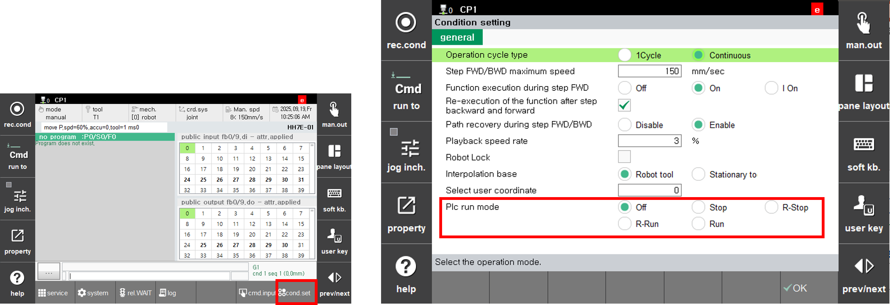
4) Verify the I/O signals in the **TIA Portal** and on the **General I/O** screen. 
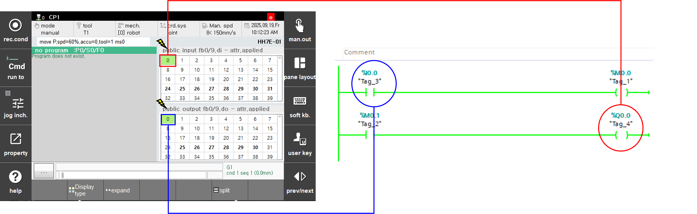

### 4.7) Assignment of PROFIsafe I/O Signals
1) Assignment of PROFIsafe I/O Signals
* Refer to the **[3.3.4.3 Safety Signal Assignment](../4-safety-io/3-Linker.md)** page.

2) Examples of PROFIsafe I/O Signal Assignment
 
 2-1) PROFIsafe Input (Direction: Master -> Slave)
  
[Set 0 bit as Arm Limit]  
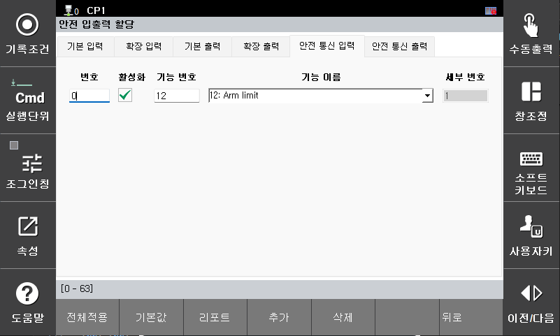
   
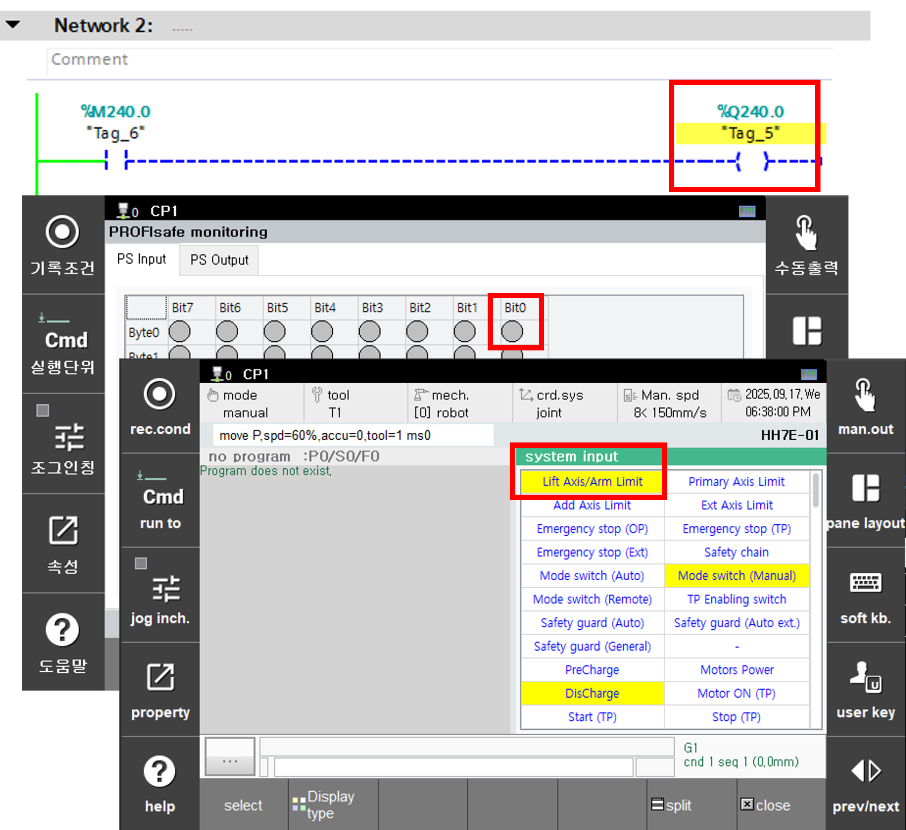
   
2-2) PROFIsafe Output (Direction: Slave -> Master)
   
[Set 0 bit as Emergency Stop State] 
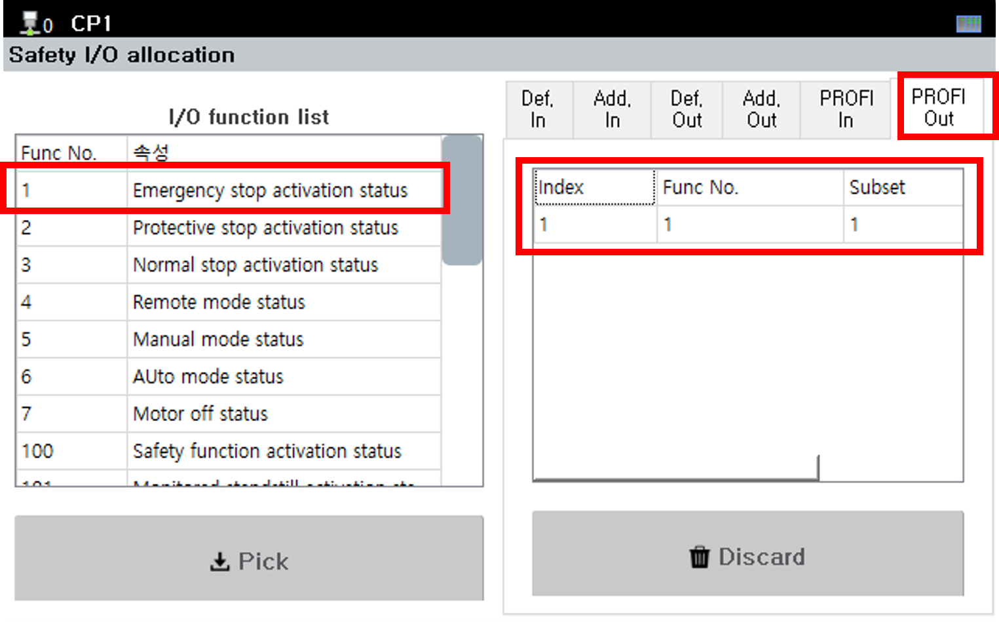
   
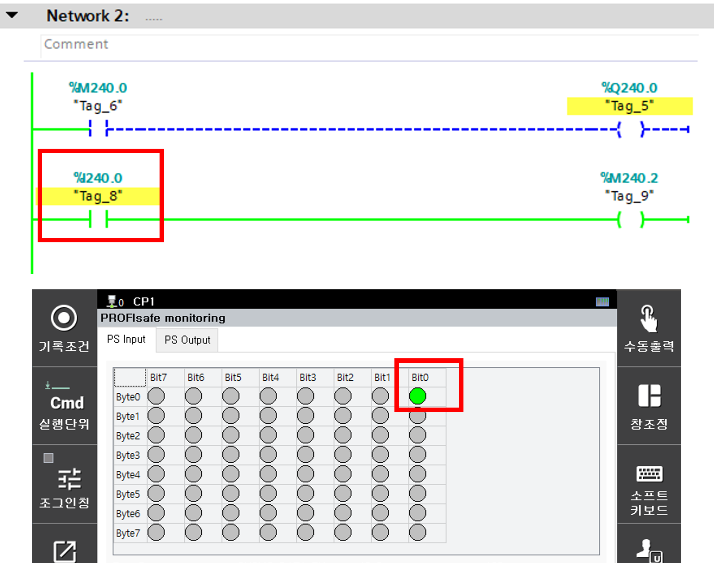

