

# 3.3.4.5 CIP Safety

## 1. What is CIP Safety?
- **CIP Safety** is a safety communication protocol that extends the standard **Common Industrial Protocol (CIP)**.
- It enables secure data exchange over **EtherNet/IP** and **DeviceNet** by utilizing the **"Black Channel"** principle.
- It complies with international safety standards such as **IEC 61508** and **ISO 13849** through mechanisms like time monitoring, redundancy, and CRC (Cyclic Redundancy Check).
 
 

## 2. Specifications
### 2.1 EtherNet/IP
- **Digital Input:** 0 ~ 240 bytes
- **Digital Output:** 0 ~ 240 bytes
- **RPI (Requested Packet Interval):** 5 ~ 3000 msec
- **Supported Communication Speed:** 10 or 100 Mbps

### 2.2 CIP Safety
- **Safety I/O:** 8/8 bytes
- **RPI (Requested Packet Interval):** 20 ~ 100 msec
 
 

## 3. CIP Safety Parameters
**[System > 2: Control Parameters > 11: Industrial Communication > 6: Safety Communication > 3: CIP Safety]** 
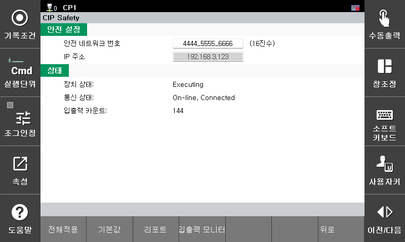

 - **Safety Network Number:** Sets the Safety Network Number (SNN).
 - **IP Address:** Displays the currently configured IP address of the EtherNet/IP Adapter.
  
* If the IP address of the EtherNet/IP Adapter is changed, you must execute **"Apply All"** for the CIP Safety parameters.

 
   

## 4. CIP Safety Configuration Procedure

1) Establish connection between Hi7 EtherNet/IP Adapter and EtherNet/IP Scanner.
2) Add EDS file via engineering tool (Studio 5000).
3) Configure CIP Safety Controller (Studio 5000).
4) Configure Hi7 (TP UI).
   4.1) EtherNet/IP Configuration
   4.2) CIP Safety Configuration
5) Verify EtherNet/IP and CIP Safety communication status.
6) Assign safety signals.

### 1 Connection between Hi7 EtherNet/IP Adapter and EtherNet/IP Scanner
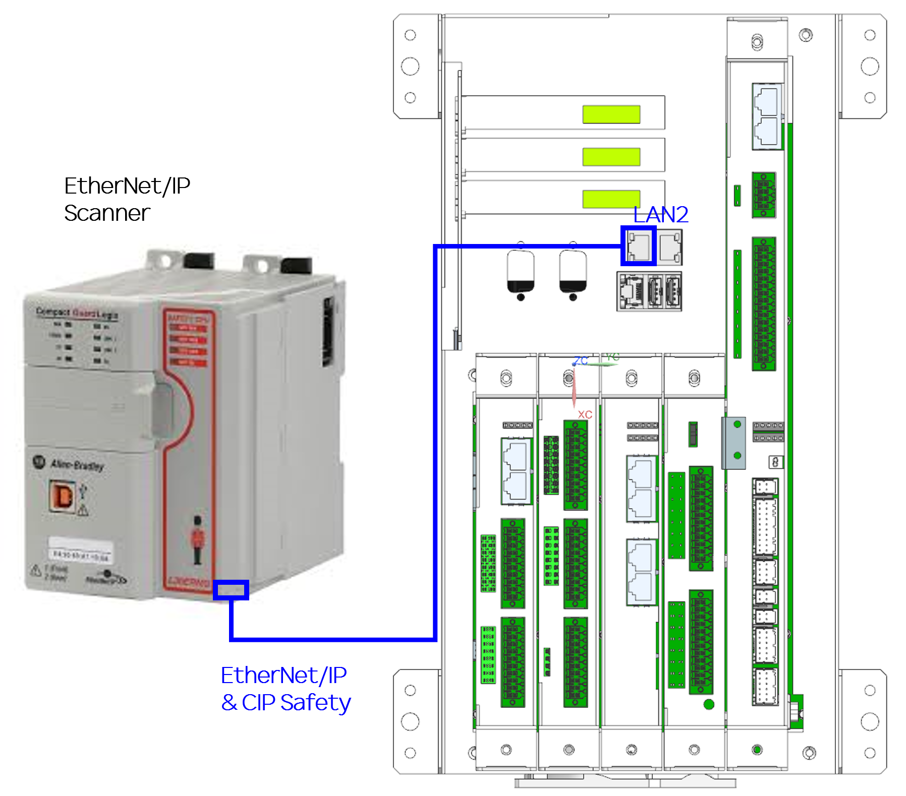

### 2 Adding EDS File via Engineering Tool (Studio 5000)
- Install the EDS file (**Hi7_EIP_251023.eds**) using the **'Device Description File Installation Tool'**.

### 3 CIP Safety Controller Configuration (Studio 5000)
1) Launch **Studio 5000** and create a new project.
2) In the **Controller Organizer**, select a controller that supports CIP Safety communication (e.g., CPU 1769-L30ERMS). Right-click on **Ethernet** and click **New Module**.
3) Search for **“Hi7 EIP Adapter”** and click the **Create** button. 
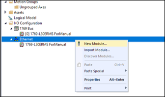

4) Enter the device name in the **Name** field.
5) Set the **IP Address** (e.g., 192.168.4.150).
6) Set the **Safety Network Number** (e.g., 1111_2222_3333). 
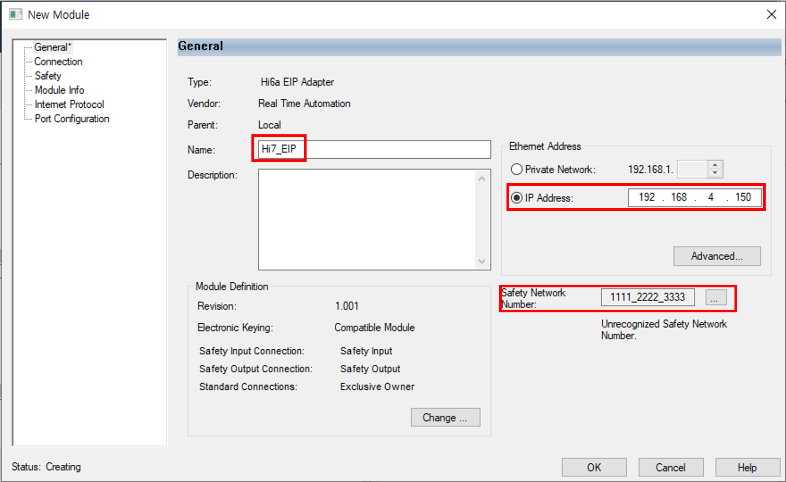

7) Click the **Change** button in the **Module Definition** to configure the sizes for Safety I/O and Standard I/O.
- **Standard I/O (Exclusive Owner):** 240 bytes
- **Safety I/O:** 8 bytes each
8) Do not configure the **"Configuration signature"**.
9) Close the **Select Module Type** window. 

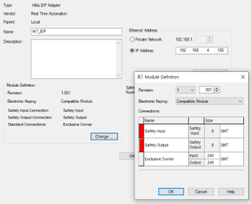
10) Verify that the module has been added successfully. 
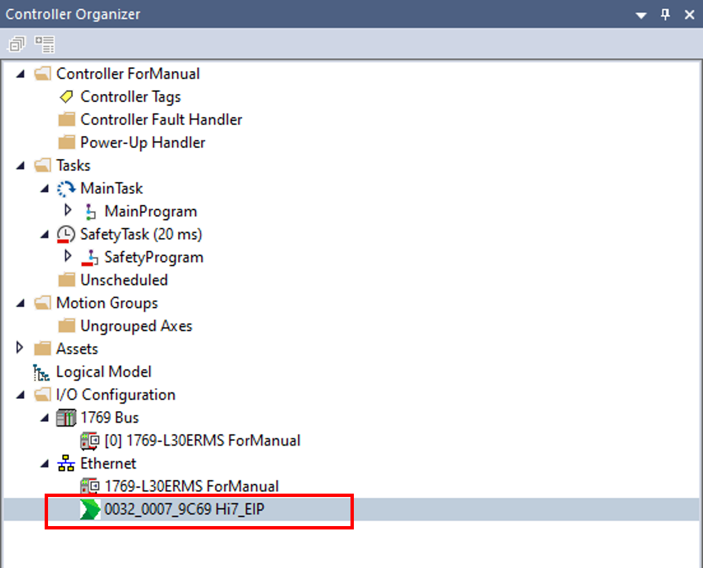
11) Click the **Offline** button in the toolbar menu and then click **Download**. 
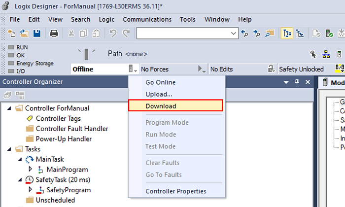
12) After the configured values are downloaded, switch the **GuardLogix** toggle from **PROG** to **RUN** mode.

### 4 Hi7 Configuration (TP UI)
#### 4.1 EtherNet/IP Configuration
1) Navigate to **System → Control Parameters → Industrial Communication → EtherNet/IP Settings**.
2) Set **Protocol** to **Adapter**.
3) Set the LAN port for the EtherNet/IP Adapter to **LAN2**.
4) Set both **Input** and **Output** sizes to **240 bytes** each.
5) Do not change the remaining settings, leaving them as shown in the figure. 
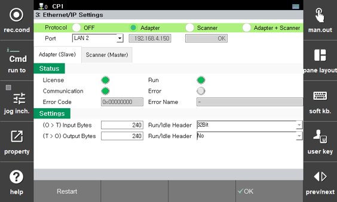

#### 4.2 CIP Safety Configuration
1) Navigate to **System → 2: Control Parameters → 11: Industrial Communication → 6: Safety Communication → 3: CIP Safety**.
2) Set the **Activation** button to **ON**.
3) Set the **SNN** (e.g., 1111_2222_3333) to match the value configured in Studio 5000.
4) Click the **Apply** button.
5) **Reboot** the robot controller. 

### 5 Verifying Communication Status
#### 5.1 EtherNet/IP
1) Verify that the **License LED** is lit.
2) Verify that the **Run LED** is lit.
3) Verify that the **Communication LED** is lit.
4) If the **Error LED** is lit, check the **Error Name** for details. 
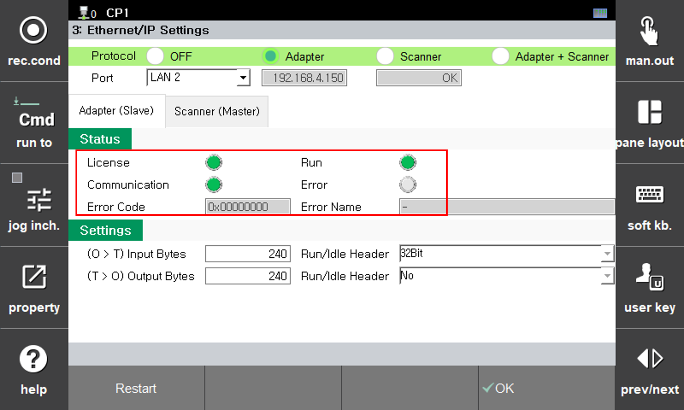

#### 5.2 CIP Safety
1) Verify that **Safety Communication** is set to **"CIP Safety"**.
2) Verify that the **Comm status** is in **“On-line, Connected”** state.
3) Verify that the **IO Count** is continuously increasing. 
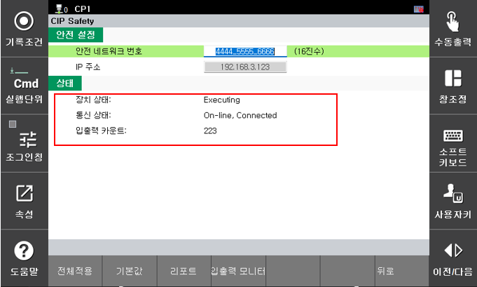

### 6 Safety Signal Assignment
#### 6.1 Assignment of CIP Safety I/O 
* Refer to the **[3.3.3.3 Safety Signal Assignment](3-safety-function/3-safety-function/3-safety-io/3-Linker.md)** page.

#### 6.2 Examples of CIP Safety I/O Assignment
1) CIP Safety Input (Direction: Master -> Slave)
1ch(0 bit) = Arm Limit 
 
   
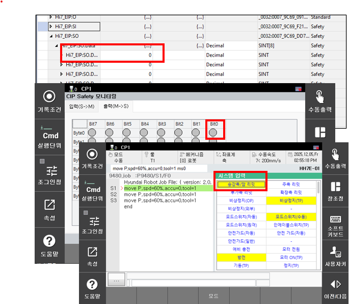 

2) CIP Safety Output (Direction: Slave -> Master)
1ch(0 bit) = E-Stop Status 
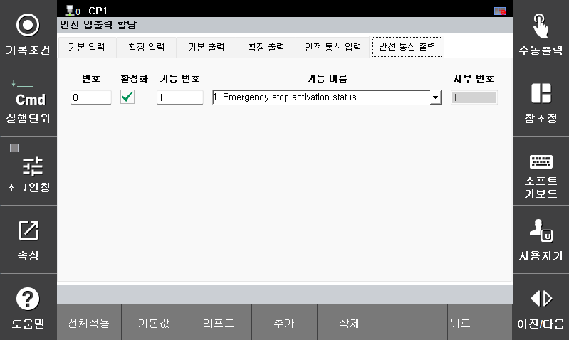 
   
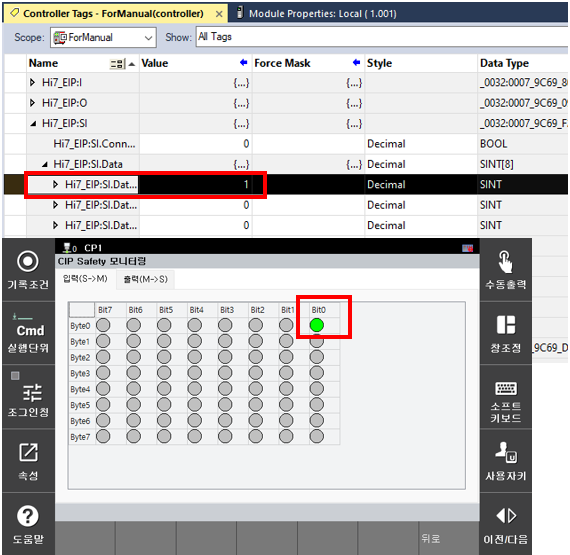 

