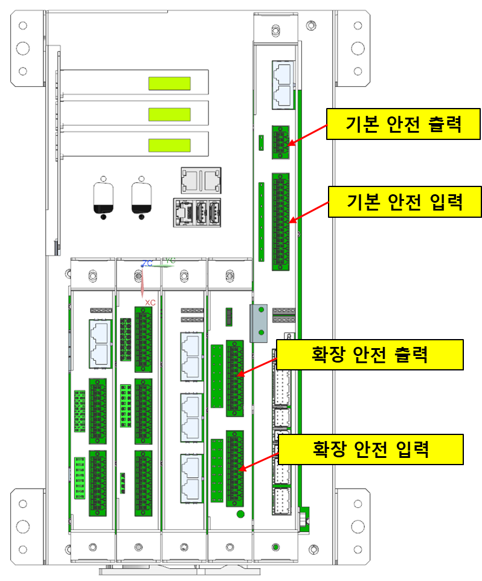

# 3.3.4 안전 입출력

안전 입출력의 기본 정보

Hi7의 안전 입출력은 다음과 같이 나뉠 수 있습니다.

| 구분  | 채널  | 옵션     |
|:------------:|:------------------------:|:--------------:|
|기본 안전 입력| 4ch x 이중입력 | - PNP, NPN 타입 선택 가능   - 내부, 외부 전원 선택 가능|
|확장 안전 입력| 8ch x 이중입력 | - PNP, NPN 타입 선택 가능   - 내부, 외부 전원 선택 가능|
|기본 안전 출력| 1ch x 이중입력 | - PNP, NPN 타입 선택 가능   - 내부, 외부 전원 선택 가능|
|확장 안전 출력| 8ch x 이중입력 | - PNP 타입   - 내부, 외부 전원 선택 가능|
|PROFIsafe 통신 안전 입력| 64 ch | |
|PROFIsafe 통신 안전 출력| 64 ch | |
|CIP Safety 통신 안전 입력| 64 ch | |
|CIP Safety 통신 안전 출력| 64 ch | |

   

