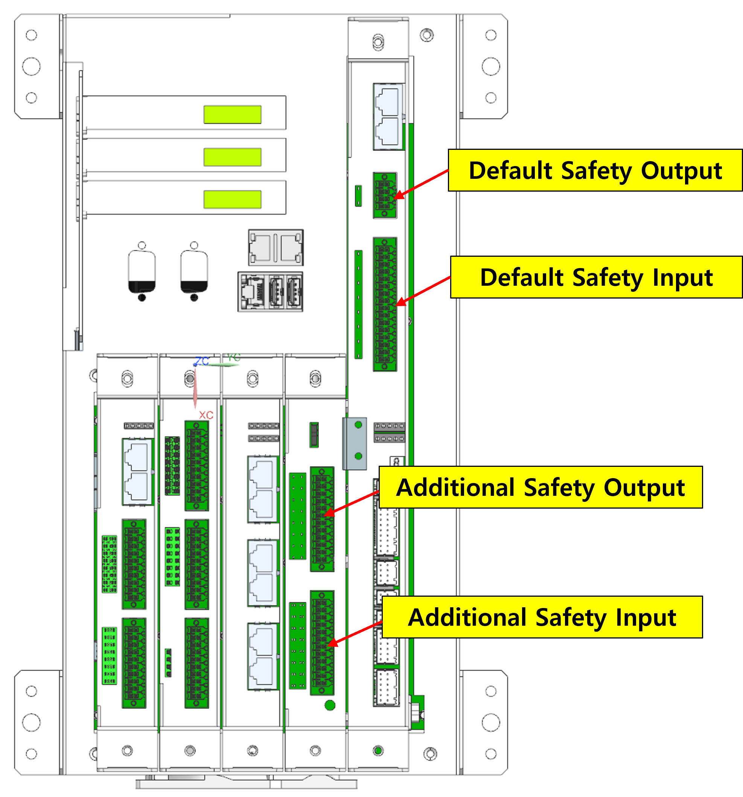

# 3.3.4 安全输入/输出

关于安全输入/输出的基本信息

Hi7 的安全输入/输出可以分为以下几类：

- 基本安全输入 (4ch x 双输入)
- 扩展安全输入 (8ch x 双输入)
- 基本安全输出 (1ch x 双输入)
- 扩展安全输出 (8ch x 双输入)
- PROFIsafe 通信安全输入 (64 点)
- PROFIsafe 通信安全输出 (64 点)
- CIP 安全通信安全输入 (64 点)
- CIP 安全通信安全输出 (64 点)

