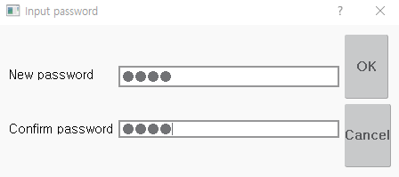

# 4.1.3 Setting of password

The parameters of the safety function must be set and managed by the designated person in charge. Users designated as administrators are given administrator privileges and passwords to set up the system. The password for setting up the system is mandatory when setting safety function parameters, and if the password is incorrect, it cannot be set by changing the parameters.

1. Push the **\[System]** button and enter the > **\[5: Initialize > 11: System password setting]** menu. The password setting window will pop up.
2. After enter the password, touch the **\[OK]** button.

* When setting the parameters of the safety function, you must enter the system setup password to save the changes.


* It is recommended that the password be set to at least 4 characters.
* If you lose your password, contact your engineer.

