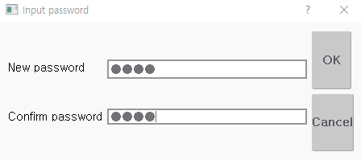

# 4.1.3 Passworteinstellung

Die Parameter für die Sicherheitsfunktionen müssen von einer dafür bestimmten Person eingestellt und verwaltet werden. Benutzer, die als Administratoren benannt sind, erhalten Administratorrechte und ein Passwort für die Systemeinstellungen. Das Passwort für die Systemeinstellungen ist eine erforderliche Eingabe bei der Einstellung der Parameter für die Sicherheitsfunktionen. Wenn das Passwort nicht korrekt ist, können die Parameter nicht geändert oder eingestellt werden.

1. **1. Tippen Sie auf die Schaltfläche \[Einstellungen] > \[5: Initialisierung > 11: Passworteinstellung]. Das Fenster zur Passworteinstellung wird angezeigt.** 버튼 > **1. Tippen Sie auf die Schaltfläche \[Einstellungen] > \[5: Initialisierung > 11: Passworteinstellung]. Das Fenster zur Passworteinstellung wird angezeigt.** 메뉴를 터치하십시오. 비밀번호 설정창이 나타납니다.
2. 비밀번호를 입력한 후 **2. Geben Sie das Passwort ein und tippen Sie auf die Schaltfläche \[OK].** 버튼을 터치하십시오.

* Sie müssen das Passwort für die Systemeinstellungen eingeben, um Änderungen beim Einstellen der Parameter für die Sicherheitsfunktionen zu speichern.


* Es wird empfohlen, ein Passwort mit mindestens 4 Zeichen festzulegen.
* Wenn Sie Ihr Passwort vergessen haben, wenden Sie sich bitte an einen Techniker.

