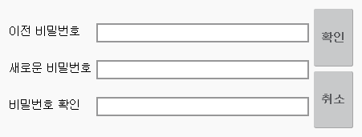

# 4.1.1 Password Setting

The safety function parameters must be set and managed by a designated person. Users designated as administrators are granted administrator privileges and a system setting password. The system setting password is a required input item when setting the safety function parameters, and the parameters cannot be changed or set if the password is incorrect.

1. Tap the `[System > 5: Reset > 11: Set System Password]` menu. The password setting window will appear.
2. Enter the password and touch the `[OK]` button.

</img>
<em>
Password setting screen
</em>

* When setting then safety function parameters, you must enter the system setting password to save changes.


* It is recommended to set the password with 4 or more characters.
* If you lose your password, contact an engineer.
* The default password is '8426'. 

