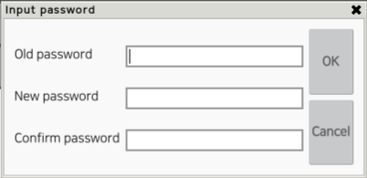

# 4.1.1 密码设置

安全功能参数必须由指定人员设置和管理。被指定为管理员的用户获得管理员权限和系统设置密码。系统设置密码是在设置安全功能参数时所需的输入项，如果密码不正确，则无法更改或设置参数。

1. 点击`[系统 > 5: 初始化 > 11: 系统密码设置]`菜单。密码设置窗口将出现。
2. 输入密码并触摸`[确定]`按钮。

</img>
<em>
密码设置屏幕
</em>

* 设置安全功能参数时，必须输入系统设置密码才能保存更改。


* 建议设置包含4个或更多字符的密码。
* 如果您忘记密码，请联系工程师。
* 默认密码是'8426'。
