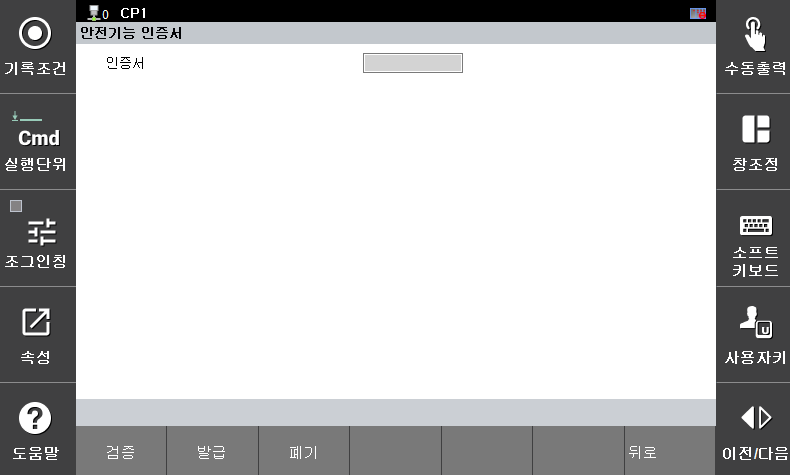

# 4.1.2 인증서 발급

안전 파라미터는 인증서를 통해 보호 됩니다. 저장된 안전 파라미터의 보안을 위해 우선 인증서를 발급 받아야 합니다. 
인증 상태 확인, 삭제 및 발급을 위해서는 시스템 암호가 필요합니다.

1. `[시스템 > 8: 안전 시스템 4: 인증서]` 메뉴를 터치하십시오.

</img>
<em>
안전 기능 인증서 설정 화면
</em>

* 인증 상태 확인
  `[검증]` 버튼을 터치하십시오.
  시스템 암호를 입력하십시오.
  결과를 확인 하십시오.

* 인증서 발급
  `[발급]` 버튼을 터치하십시오.
  시스템 암호를 입력하십시오.
  결과를 확인 하십시오.

* 인증서 폐기
  `[폐기]` 버튼을 터치하십시오.
  시스템 암호를 입력하십시오.
  결과를 확인 하십시오.
