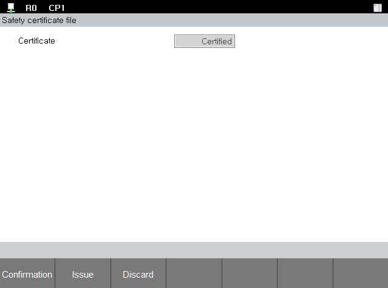

# 4.1.4 Zertifikatausstellung

Sicherheitsparameter werden durch Zertifikate geschützt. Um gespeicherte Sicherheitsparameter zu sichern, müssen Sie zunächst ein Zertifikat erwerben.
Zum Überprüfen des Zertifikatsstatus, zum Löschen und zum Ausstellen ist ein Systempasswort erforderlich.

1. **1. Tippen Sie auf die Schaltfläche \[Einstellungen] > \[4: Anwendungsparameter > 18: Sicherheitsabstand 2.0 > Zertifikat].** 버튼 > **1. Tippen Sie auf die Schaltfläche \[Einstellungen] > \[4: Anwendungsparameter > 18: Sicherheitsabstand 2.0 > Zertifikat].** 메뉴를 터치하십시오.

* Zertifikatsstatus überprüfen
\[Prüfen]* Tippen Sie auf die Schaltfläche.
Geben Sie das Systempasswort ein.
\Ergebnis überprüfen.

* Zertifikat ausstellen
\[Ausstellen]* Tippen Sie auf die Schaltfläche.
Geben Sie das Systempasswort ein.
Ergebnis überprüfen.

* Zertifikat verwerfen
\[Verwerfen]* Tippen Sie auf die Schaltfläche.
Geben Sie das Systempasswort ein.
Ergebnis überprüfen.
