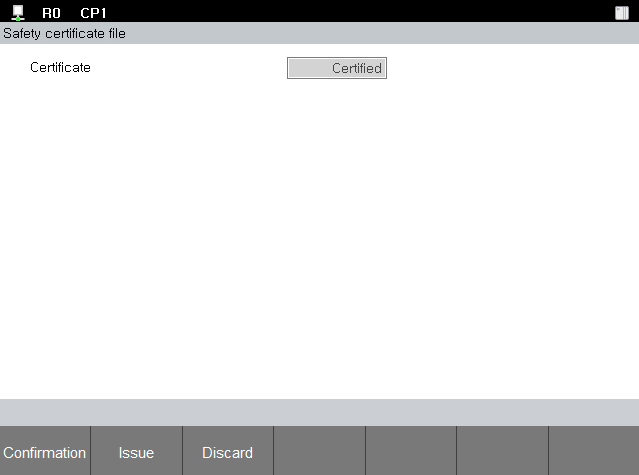

# 4.1.4 Certification

Safety parameters are protected by the certificate; for the security of the stored safety parameters, you must first issue a certificate. A system password is required to verify, delete, and issue authentication status.

1. **\[System]** button > **\[4: Application parameter > 18: SafeSpace2.0 > Certificate file]**

* Verify certificate status
  Touch the **\[Confirmation]** button.
  Enter the system password.
  check the result.

* Issue certificate file
  Touch the **\[Issue]** button.
  Enter the system password.
  check the result.

* Discard certificate file
  Touch the **\[Discard]** button.
  Enter the system password.
  check the result.
