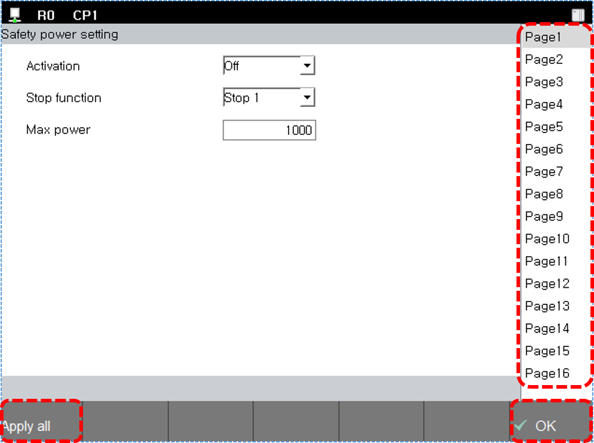
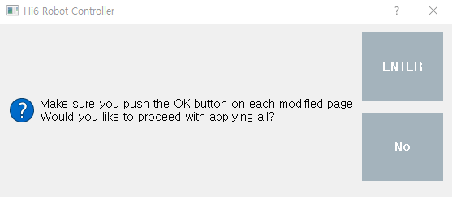
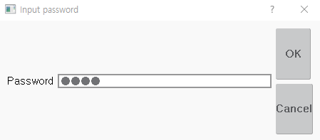

# 4.2 안전 파라미터 전송

안전파라미터 값을 수정 하고 시스템에 적용 하십시오. 적용이 왼료 되지 않은 값은 설정 화면이 바뀌면 초기화 됩니다.

1. **\[설정]** 버튼 > **\[4: 응용 파라미터 > 18: 안전공간2.0 > 파라미터 설정]** 변경을 원하는 메뉴를 터치하십시오.

2. 페이지 버튼을 터치하여 수정하고자 하는 페이지로 이동 하십시오. **\[확인]** 버튼을 누르지 않은 경우 페이지 이동 시 파라미터가 초기화 됩니다.
3. 파라미터 값을 수정하고 **\[확인]** 버튼을 터치하십시오. 페이지의 파라미터가 임시 저장됩니다.

* 페이지의 수정된 값을 확인 하고 **\[전체 적용]** 버튼을 터치하십시오. 

* **\[확인]** 버튼을 누르지 않은 페이지는 반영되지 않습니다. 메시지를 확인한 후 진행 하십시오.

* **\[시스템 암호]** 를 입력하고 결과를 확인 하십시오.

 