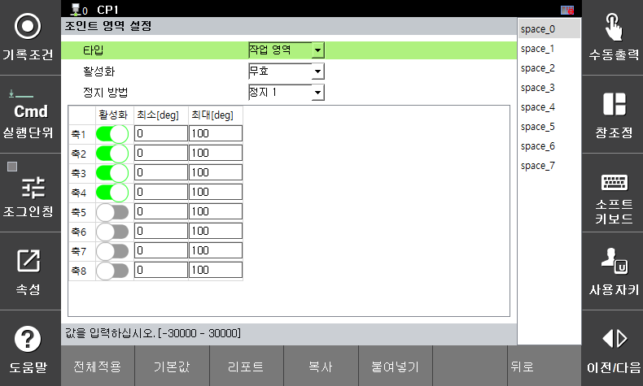
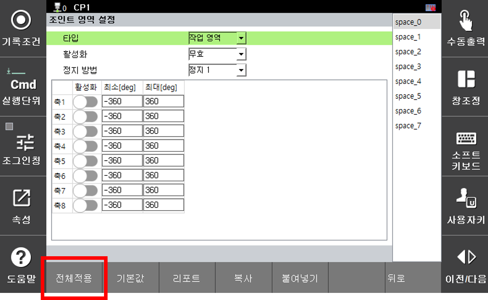
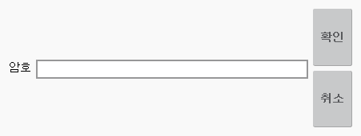
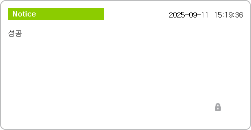

# 4.2 안전 파라미터 전송

안전 파라미터 값을 수정하고 시스템에 적용할 수 있습니다. 전송을 완료하지 않은 값은 설정 화면에서 벗어나는 경우 초기화 됩니다.

1. `[시스템 > 10: 안전 시스템]` 아래의 변경을 원하는 메뉴에 진입하세요.

</img>
<em>
안전 파라미터 설정 화면 진입 예시
</em>

2. 페이지가 있는 경우 수정하고자 하는 페이지로 이동하세요. 각 페이지에 작성된 값은 임시로 저장됩니다. (`[전체적용]`을 누르지 않고 메뉴를 벗어날 시 반영되지 않습니다.)

3. 설정하고자 하는 값을 입력한 후 `[전체 적용]` 버튼을 누르세요. 

</img>
<em>
안전 파라미터 설정 예시
</em>

4. 시스템에 설정된 비밀번호를 입력하세요.

</img>
<em>
비밀번호 입력 화면
</em>

5. 올바른 비밀번호를 입력하는 경우 파라미터가 전송됩니다. 전송 결과를 확인하세요.

</img>
<em>
전송 성공 시 출력 화면
</em>


**\[주의]** : 로봇 응용을 사용하기 전 모든 안전 파라미터는 반드시 검증 및 확인 되어야 합니다. 

* 안전 파라미터 검증은 시스템의 안전 기능이 의도한 대로 동작함을 보장하기 위한 필수 절차 입니다.
* 검증 및 확인은 초기 설정 시 뿐만 아니라, 파라미터가 변경된 모든 경우에도 반드시 수행되어야 합니다.
* 안전 파라미터를 검증하지 않을 경우, 안전 기능이 의도대로 동작하지 않을 수 있으며 작업자에게 위험을 초래할 수 있습니다.
