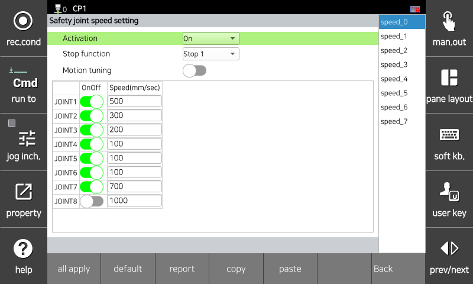
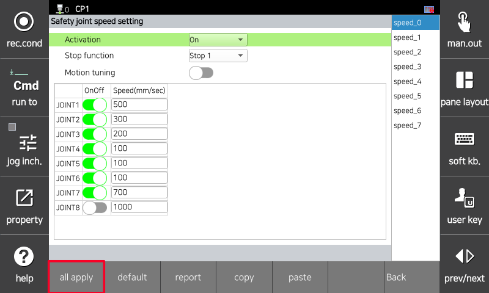
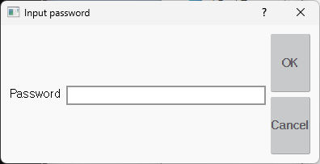
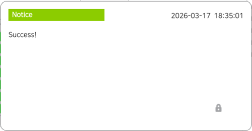

# 4.3 Safety Parameter Transfer

You can edit safety parameter values   and apply them to the system. Any values   that haven't been transferred will be reset when you exit the settings screen.

1. Go to `[System > 10: Safety System]` and select the menu you want to change.

</img>
<em>
Example of entering the safety parameter setting screen
</em>

2. If you have multiple pages, navigate to the page you wish to edit. The values   entered on each page are temporarily saved. (If you exit the menu without clicking "Apply to All," the changes will not be reflected.)

3. Enter the desired values   and click the `[Apply to All]` button.

</img>
<em>
Safety parameter setting example
</em>

4. Enter the password set in the system.

</img>
<em>
Password input screen
</em>

5. If you enter the correct password, the parameters will be transmitted. Check the transmission results.

</img>
<em>
Output screen when transmission is successful
</em>


<strong>[Warning]</strong> : Before using the robot application, all safety parameters shall be verified and confirmed.

* Verification of safety parameters is an essential procedure to ensure that the safety functions operate as intended.
* Verification and validation shall be performed not only during initial setup but also after any modification of the parameters.
* Failure to verify safety parameters may result in safety functions not operating as intended and may pose a risk to personnel.
{% endhint %3


<strong>[Avertissement]</strong> : Avant d'utiliser l'application du robot, tous les paramètres de sécurité doivent être vérifiés et confirmés.
La vérification des paramètres de sécurité est une procédure essentielle pour garantir que les fonctions de sécurité fonctionnent comme prévu.
La vérification et la validation doivent être effectuées non seulement lors de la configuration initiale, mais également après toute modification des paramètres.
Le non-respect de la vérification des paramètres de sécurité peut entraîner un fonctionnement non conforme des fonctions de sécurité et présenter un risque pour le personnel.
