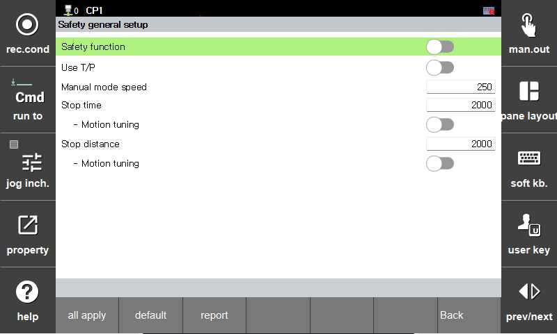
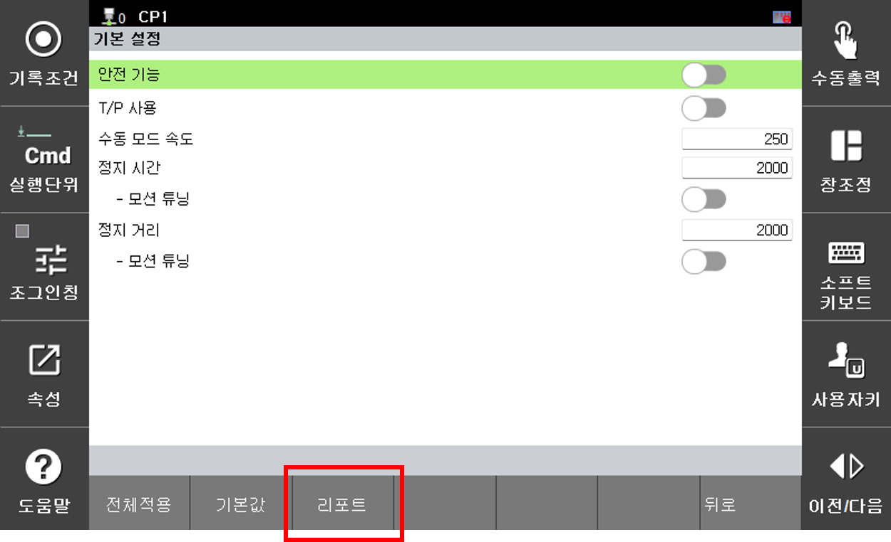
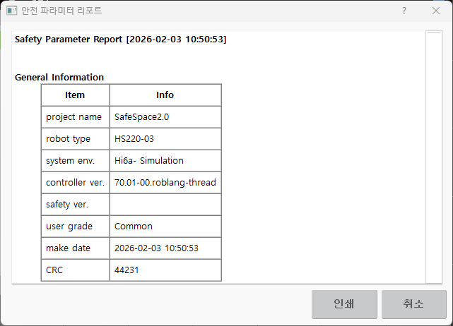
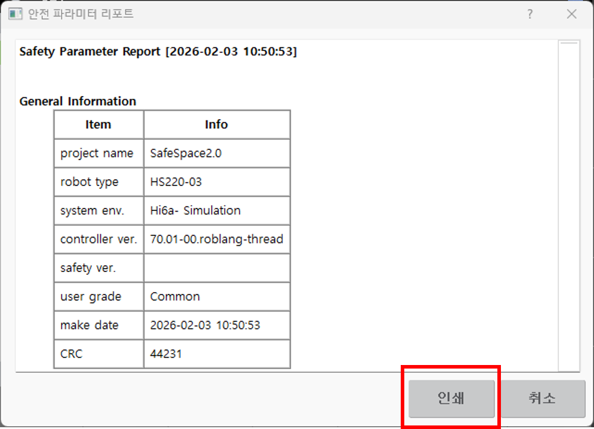
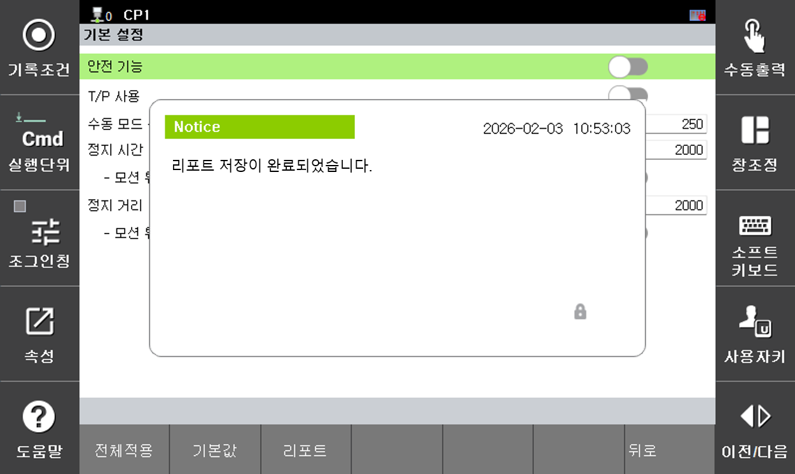

# 4.3 Safety Parameter Report

You can view the currently applied safety parameter values in a report format.
If the values on the settings screen have not been saved, they may differ from the values shown in the report.

1. Go to the menu you want to modify under `[System > 10: Safety System]`.

</img>
<em>
Example of entering the safety parameter setting screen
</em>

2. To generate a report, click the **\[Report]** button at the bottom.

</img>
<em>
Example of generating a report
</em>

3. The report will be created and displayed on the screen.

</img>
<em>
Example of the report display screen
</em>

4. If you want to save the generated report, click the **\[Print]** button.

</img>
<em>
Example of the report print screen
</em>

5. The password entry screen will appear. Enter the correct password.

</img>
<em>
Example of the password entry screen
</em>

6. If the correct password is entered, the report will be saved and a notification window indicating that the save is complete will be displayed.

</img>
<em>
Example of the report save completion screen
</em>

