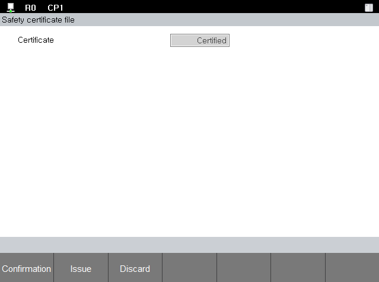

# 4.1.4 인증서 발급

안전 파라미터는 인증서를 통해 보호 됩니다. 저장된 안전 파라미터의 보안을 위해 우선 인증서를 발급 받아야 합니다. 
인증 상태 확인, 삭제 및 발급을 위해서는 시스템 암호가 필요합니다.

1. **\[설정]** 버튼 > **\[4: 응용 파라미터 > 18: 안전공간2.0 > 인증서]** 메뉴를 터치하십시오.

* 인증 상태 확인
  **\[확인]** 버튼을 터치하십시오.
  시스템 암호를 입력하십시오.
  \결과를 확인 하십시오.

* 인증서 발급
  **\[발급]** 버튼을 터치하십시오.
  시스템 암호를 입력하십시오.
  결과를 확인 하십시오.

* 인증서 폐기
  **\[폐기]** 버튼을 터치하십시오.
  시스템 암호를 입력하십시오.
  결과를 확인 하십시오.
