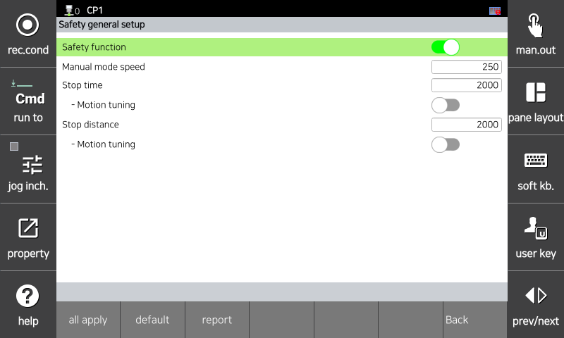
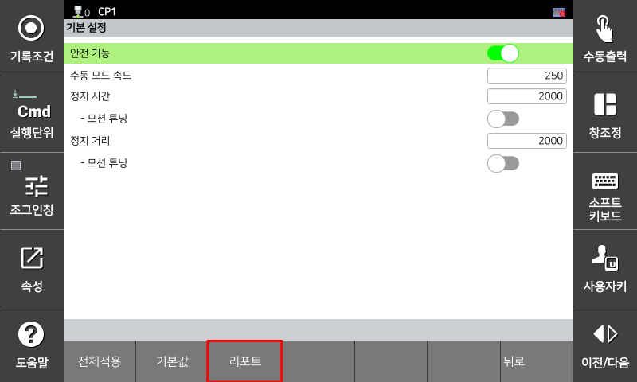
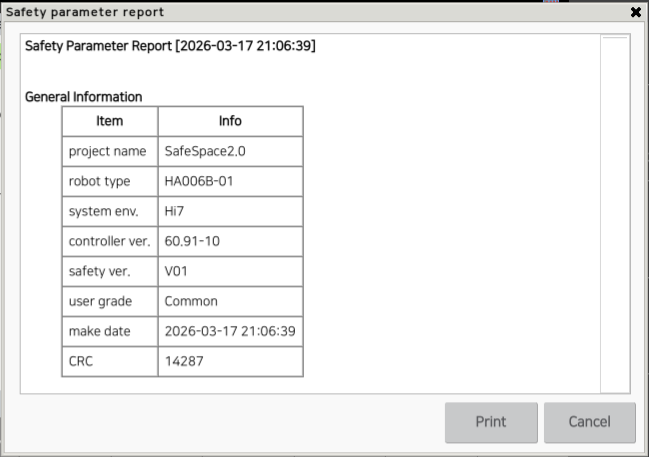
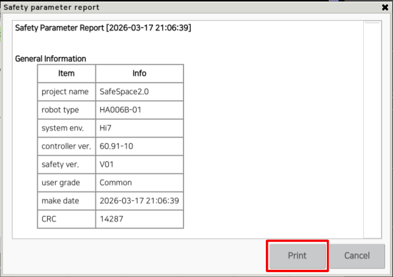

# 4.4 안전 파라미터 리포트

현재 적용되어 있는 안전 파라미터 값을 리포트 형식으로 확인할 수 있습니다. 설정 화면 내 값을 저장하지 않은 경우 리포트에 출력되는 값과 다를 수 있습니다.

1. **\[시스템 > 10: 안전 시스템]** 아래의 변경을 원하는 메뉴에 진입하세요.

</img>
<em>
안전 파라미터 설정 화면 진입 예시
</em>

2. 리포트를 출력하고자 하는 경우 하단의 **\[리포트]** 버튼을 누르세요. 

</img>
<em>
리포트 출력 예시
</em>

3. 리포트를 생성하고 화면에 출력됩니다.

</img>
<em>
리포트 출력 화면 예시
</em>

4. 생성한 리포트를 저장하고 싶으신 경우 **\[인쇄]** 버튼을 누르세요.

</img>
<em>
리포트 인쇄 화면 예시
</em>

5. 비밀번호 입력 화면이 출력됩니다. 올바른 비밀번호를 입력하세요.

</img>
<em>
비밀번호 입력 화면 예시
</em>

6. 올바른 비밀번호를 입력하는 경우 리포트를 저장하고, 저장이 완료되었음을 알려주는 안내창이 출력됩니다.

</img>
<em>
리포트 저장 완료 화면 예시
</em>


* 안전 파라미터는 무결성을 보장하기 위하여 식별자(CRC)로 보호됩니다. 
* 식별자는 모든 안전 파라미터를 기반으로 계산되며, 모든 안전 기능과 관련된 파라미터를 포함하여 계산됩니다. 
* 안전 파라미터를 변경하는 경우 식별자 값도 함께 변경되며, 식별자 값은 안전 파라미터 리포트의 CRC 항목에서 확인할 수 있습니다. 
* 식별자는 포함된 안전 기능과 해당 파라미터의 집합을 고유하게 식별합니다.

