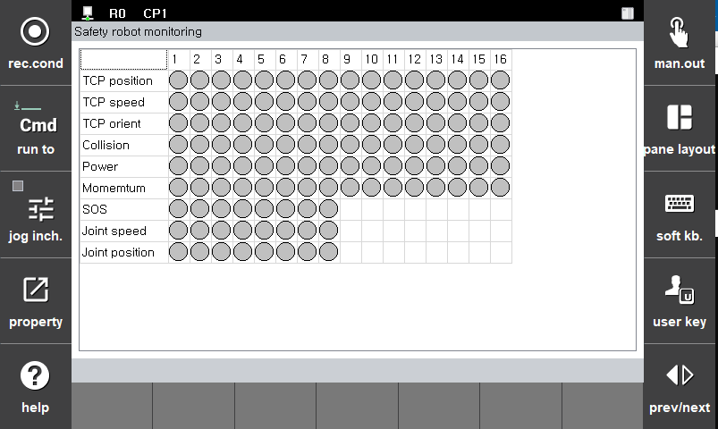

# 5.1 Robot monitoring function status

You can check robot monitoring function status in **\[System > 4: Application parameter > 18: SafeSpace2.0 > Monitoring] > [Robot monitoring status]** menu.

* Check the robot monitoring function status
  * **\[TCP position]**: TCP position monitoring violations
  * **\[TCP speed]**: TCP speed monitoring violations
  * **\[TCP orient]**: TCP orientation monitoring violations
  * **\[Power]**: Power monitoring violations
  * **\[Momentum]**: Momentum monitoring violations
  * **\[Collision]**: Collision detectionmonitoring violations
  * **\[SOS]**: SOS(Safe Operating Stop) monitoring violations
  * **\[Joint speed]**: Joint speed monitoring violations
  * **\[Joint position]**: Joint position monitoring violations
  
