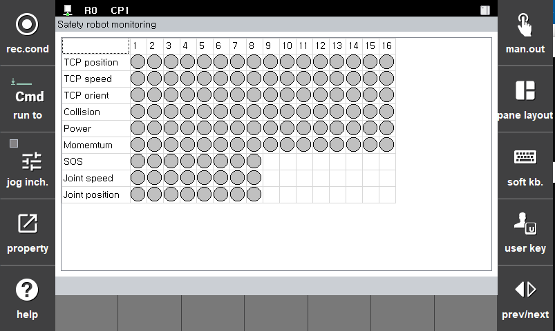

# 5.1 Roboterüberwachungsfunktion

Wählen Sie das Menü \[System > 4: Anwendungsparameter > 18: SafeSpace2.0 > Überwachung] > [Roboterüberwachung]*, um den Status der Roboterüberwachungsfunktion zu überprüfen.

* Überprüfen Sie den Status der Roboterüberwachungsfunktion.
  * **\[TCP-Position]: Status Verletzung der TCP-Positionsüberwachung**: TCP 위치 모니터링 위반 여부
  * **\[TCP-Geschwindigkeit]: Status Verletzung der TCP-Geschwindigkeitsüberwachung**: TCP 속도 모니터링 위반 여부
  * **\[TCP-Orientierung]: Status Verletzung der TCP-Orientierungsüberwachung**: TCP 방향 모니터링 위반 여부
  * **\[Leistung]: Status Verletzung der Leistungsüberwachung**: 파워 모니터링 위반 여부
  * **\[Moment]: Status Verletzung der Momentenüberwachung**: 모멘텀 모니터링 위반 여부
  * **\[Kollision]: Status Verletzung der Kollisionsüberwachung**: 충돌 모니터링 위반 여부
  * **\[SOS]: (Überwachung des sicheren Betriebshalts) Status Verletzung der SOS-Überwachung**: (안전 정지 감시) SOS 모니터링 위반 여부
  * **\[Gelenkposition]: Status Verletzung der Gelenkpositionsüberwachung**: 조인트 위치 모니터링 위반 여부
  * **\[Gelenkgeschwindigkeit]: Status Verletzung der Gelenkgeschwindigkeitsüberwachung**: 조인트 속도 모니터링 위반 여부
