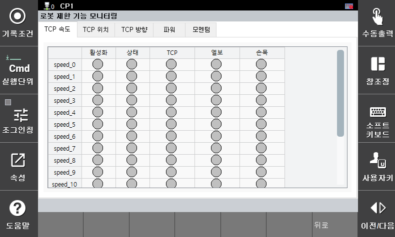
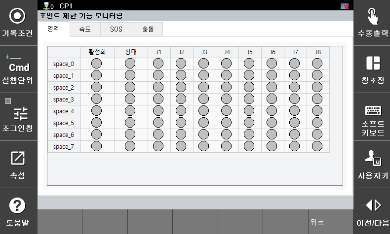

# 5.1 Robot Monitoring Function Monitoring

You can check the robot TCP speed/TCP position/TCP direction/power/momentum status by selecting the **\[System > 8: Safety System > 3: Monitoring > 1: Robot Status]** menu.

</img>
<em>
Robot status monitoring screen
</em>

* Check the status of the robot monitoring function.
  * **\[TCP Position]**: TCP position monitoring violation status
  * **\[TCP Speed]**: TCP speed monitoring violation status
  * **\[TCP Orientation]**: TCP orientation monitoring violation status
  * **\[Power]**: Power monitoring violation status
  * **\[Momentum]**: Momentum monitoring violation status

---

You can check joint area/speed/SOS/collision status by selecting the **\[System > 8: Safety System > 3: Monitoring > 2: Joint Status]** menu.

</img>
<em>
Joint Status Monitoring Screen
</em>

* Check the status of the joint limit function.
* **\[Joint Area]**: Whether joint area monitoring is violated.
* **\[Joint Speed]**: Whether joint speed monitoring is violated.
* **\[Collision]**: Whether collision monitoring is violated.
* **\[SOS]**: Whether (Safety Stop Monitoring) SOS monitoring is violated.
