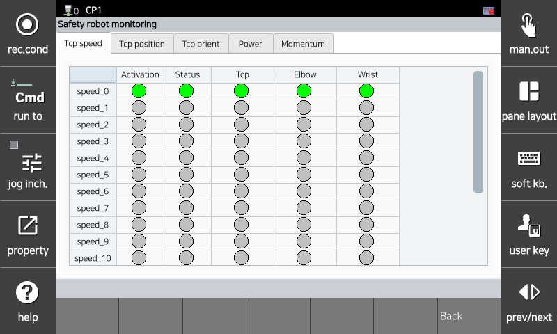
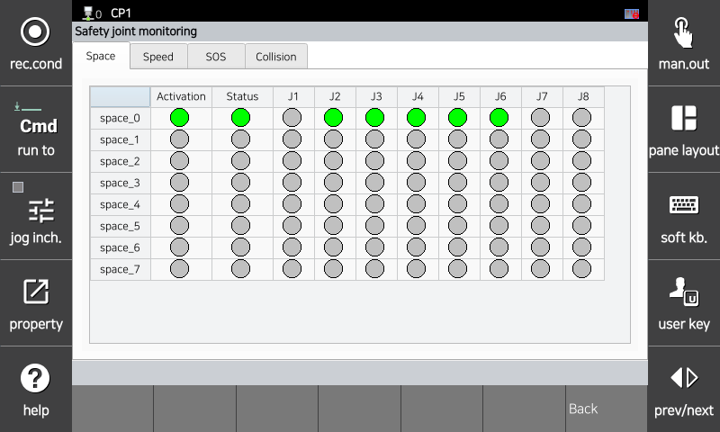

# 5.1 机器人监控功能监控

您可以通过选择 `[System > 10: Safety System > 3: Monitoring > 1: Robot Status]` 菜单来检查机器人的 TCP 速度/TCP 位置/TCP 方向/电源/动量状态。

</img>
<em>
机器人状态监控屏幕
</em>

* 检查机器人监控功能的状态。
  * **\[TCP 位置]**: TCP 位置监控违规状态
  * **\[TCP 速度]**: TCP 速度监控违规状态
  * **\[TCP 方向]**: TCP 方向监控违规状态
  * **\[电源]**: 电源监控违规状态
  * **\[动量]**: 动量监控违规状态

---

您可以通过选择 `[System > 10: Safety System > 3: Monitoring > 2: Joint Status]` 菜单来检查关节区域/速度/SOS/碰撞状态。

</img>
<em>
关节状态监控屏幕
</em>

* 检查关节限制功能的状态。
* **\[关节区域]**: 是否违反关节区域监控。
* **\[关节速度]**: 是否违反关节速度监控。
* **\[碰撞]**: 是否违反碰撞监控。
* **\[SOS]**: 是否违反（安全停止监控）SOS 监控。