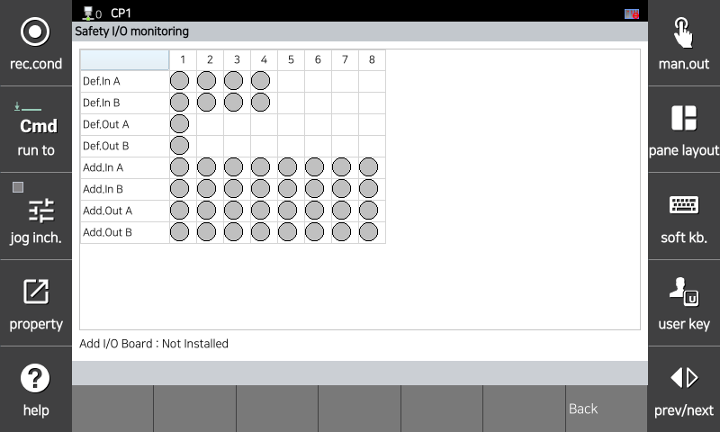

# 5.2 安全 I/O 状态

You can monitor the system's basic/extended safety I/O status by selecting the `[System > 10: Safety System > 3: Monitoring > 3: Safety I/O Status]` menu.

</img>
<em>
安全输入/输出状态监控屏幕
</em>

