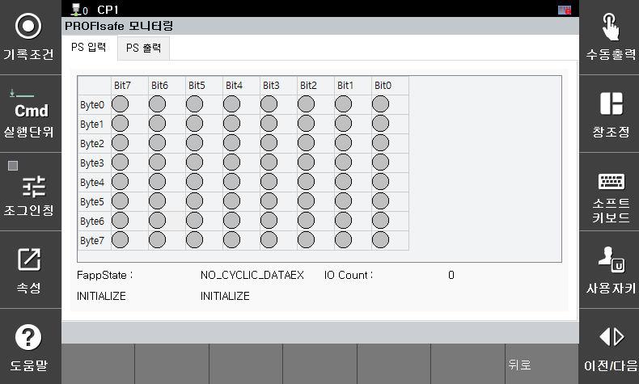

# 5.4 PROFISAFE Monitoring

You can monitor the input/output status of PROFISAFE by selecting **\[System > 8: Safety System > 3: Monitoring > 5: PROFISAFE Status]**.

</img>
<em>
PROFISAFE Status Monitoring Screen
</em>

