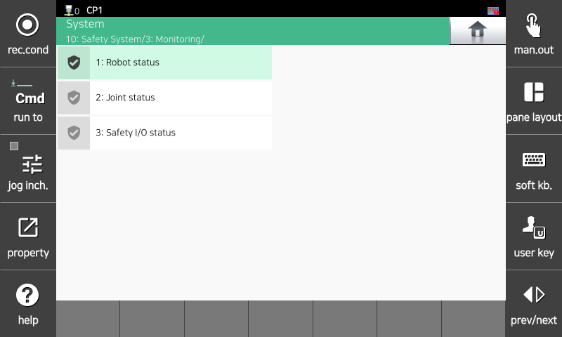

# 5. Safety Status Monitoring

Monitors safety function violations and the status of the Safety Control Module (SCM) board. You can check the information of the status of robot monitoring functions and safety input/output.

Check the `[System > 8: Safety System > 3: Monitoring]` menu.

</img>
<em>
Safety Status Monitoring Menu
</em>

