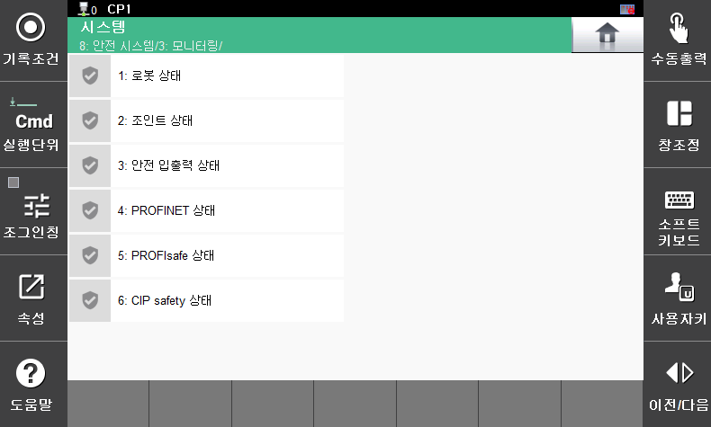

# 5. Überwachung des Sicherheitsstatus

Überwachen Sie Verstöße gegen Sicherheitsfunktionen und den Status der SCM-Platine (SCM: Safety Control Module). Sie können den Status der Roboterüberwachungsfunktionen und die Statusinformationen der Sicherheitsein- und -ausgänge überprüfen.

Überprüfen Sie das Menü **\[System > 8: Sicherheitssystem > 3: Überwachung]**.

</img>
<em>
Menü „Überwachung des Sicherheitsstatus“
</em>

