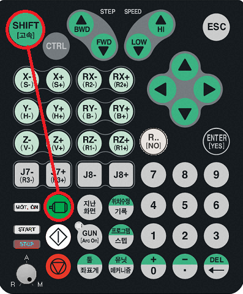
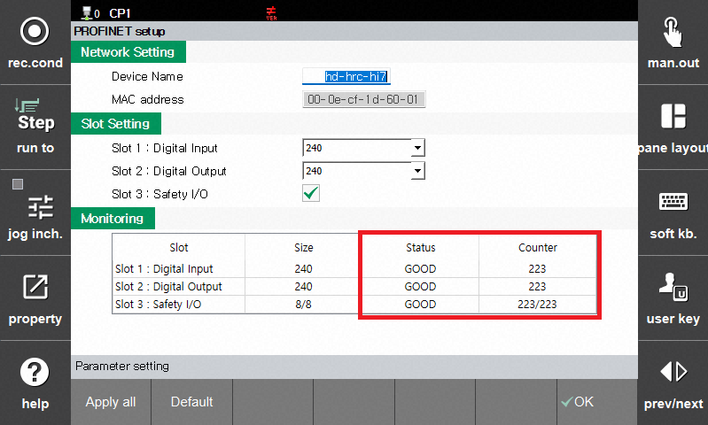
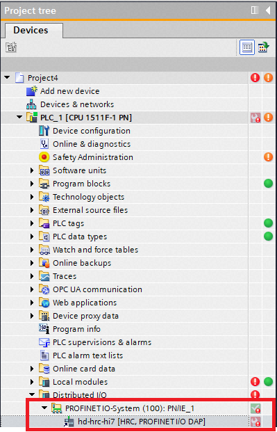
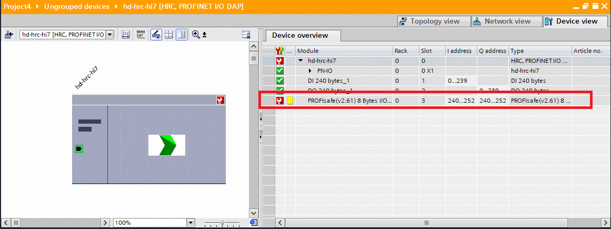
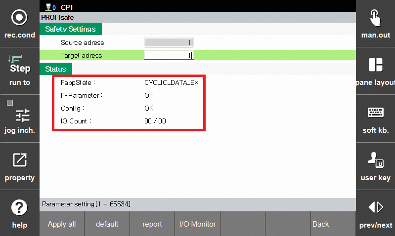
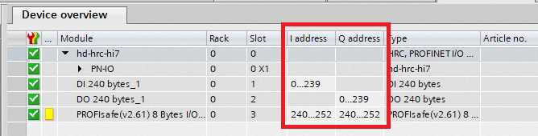
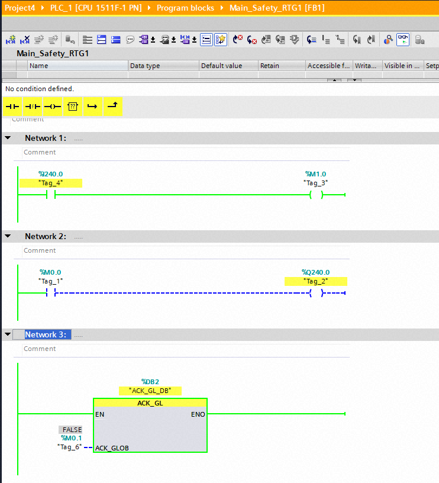

# Case 1 - PROFIsafe Communication Not Restored After PLC S/W Download

## 1) Condition
This issue may occur when the PLC software (ladder program or communication settings) is modified and a PLC S/W Download is performed while PROFIsafe (PROFINET) communication is operating normally.

## 2) Cause and Solution

During the PLC S/W Download, PROFIsafe (PROFINET) communication between the PLC and Hi7 may be temporarily interrupted. In this case, the following alarms may occur:

- E52202 PROFINET Communication Disconnected
- E52306 F-Watchdog Alarm

In most cases, the alarms are cleared and communication returns to normal after the PLC software download is completed and the PLC restarts.

In some cases, the PROFINET alarms may not be cleared automatically. In this case, the alarms can be cleared by performing the **[Motor ON] operation**.

However, for PROFIsafe communication, the **re-integration process using the [ACK_GL] Function Block is required**, even after PROFINET communication has returned to normal.

For more information, refer to the procedure below.

## 3) Procedure

### Step 1) Clear the Alarms
- Press the `[Shift]` + `[Mot.ON]` buttons to clear the alarms. 
**(※ V70.04-00 and later: The alarms are automatically cleared when PROFINET communication is reconnected.)**

</img>

 
 

### Step 2) Check the PROFINET Communication Status
- Go to `[System]` → `[Control Parameters]` → `[Industrial Communication]` → `[PROFINET Settings]` and check the communication status.

As shown in the figure below, the status of all configured slots should be **GOOD**, and all counters should be increasing. If not, check the **device name**, **slot settings**, and **communication cable**.

</img>

 
 

### Step 3) Clear the Safety Module Error

- Apply a rising-edge signal to `ACK_GLOB` of the **ACK-GL** Function Block to clear the Safety module error.
(Refer to the Ladder program example in Section 4.)

The following figure shows the screen when PROFIsafe communication requires the **Re-integration** process after PROFINET communication has been successfully restored.

</img>
 [Project Tree]

</img>
 [Device overview]

</img>
 [PROFIsafe config]

FappState : Cycle_DATA_EX 
F-Parameter : OK 
Config : OK 
IO Count : Input(increasing) / **Output(no change)** 

## 4) Ladder Program Example

- Refer to the Safety Ladder implementation example.

Network 1: Use Bit 0 of the PROFIsafe input (Hi7 → PLC) 
Network 2: Use Bit 0 of the PROFIsafe output (PLC → Hi7) 
Network 3: **ACK_GL** (Apply a rising-edge signal to ACK_GLOB to perform the Re-integration process) 

</img>
 [IO 주소 확인]

</img>
 [Sample Ladder]

