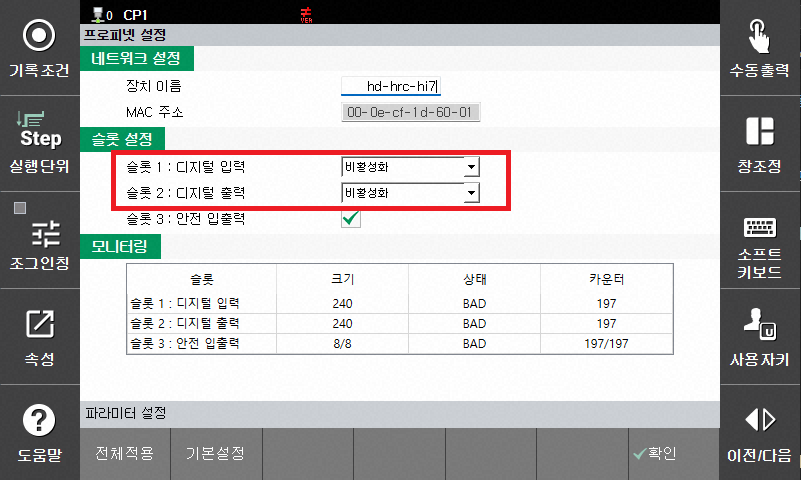
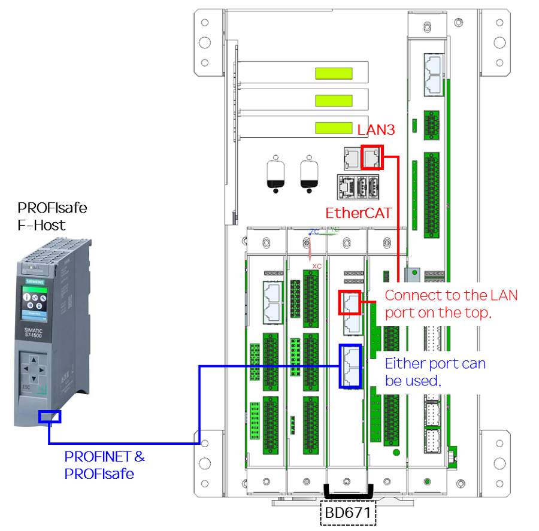
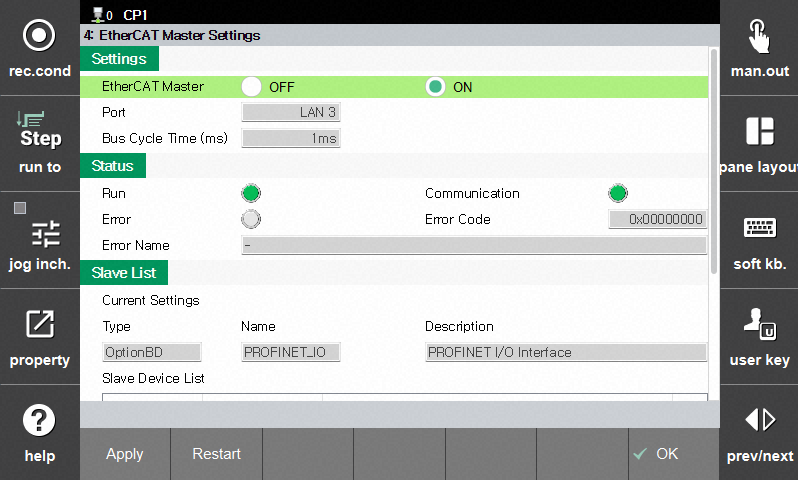
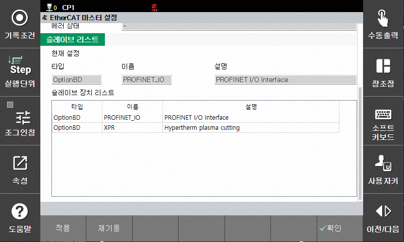

# Case 2 - 슬롯 설정이 불가능한 경우 (내부 통신 연결 안됨)

## 1) 발생 상황

다음과 같은 상황에서는 PROFIsafe 보드(BD671)와 MainCom과의 연결상태 확인 필요
- PROFIsafe 보드(BD671)를 처음 설치하거나 교환 했을 때 
- Hi7 Main Com과 연결되는 내부 통신선을 재연결 했을 때
- 프로젝트 파일을 초기화하여 EtherCAT Master 설정을 다시해야 하는 경우

## 2) 발생 원인 및 조치 방법

PROFIsafe 보드(BD671)는 기본적으로 Main Com과의 연결이 필요합니다. 보드를 재설치하거나 내부 통신 설정을 변경하는 경우, 아래 절차를 수행하여 내부 통신 상태가 정상인지 확인해야 합니다.

**Step 1)** Main Com과의 연결  
**Step 2)** EtherCAT Master 설정

#### 원인 별 확인 사항 요약
- W29202 EtherCAT 마스터 IO 채널 연결된 Slave 연결 상태 이상 -> LAN선 연결 확인
- Link/Act LED 상태 이상 -> LAN선 및 보드 이상 점검
- EtherCAT Master 미설정 -> 아래 절차 Step2 참고
- 슬롯 설정이 비활성화 -> 아래 Step1, 2 참고

</img>

자세한 방법은 아래 조치 절차를 참조하십시오.

## 3) 조치 절차

### Step 1) Main Com과의 연결

아래 그림과 같이 빨간색으로 표시 된 랜선으로 Main Com과 PROFIsafe 보드(BD671)를 연결하고 각 LAN Port의 Link/Act & Speed LED의 점등 상태를 확인한다.

</img>

**제어기 부팅 후 LED 확인**
- Link/Act LED (녹색) - 점멸
- Speed LED (주황색) - 점등

**LAN선의 재연결 후에는 제어기를 재부팅 시켜 주십시오.** 

 
 

### Step 2) EtherCAT Master 설정
- `[시스템]` → `[제어 파라미터]` → `[산업용 통신]`  → `[EtherCAT 마스터 설정]` 화면으로 이동한다.

아래 그림과 같이 설정이 되어 있는지 확인
- EtherCAT 마스터 : ON
- 동작, 통신 LED : ON
- 슬레이브 리스트 에서 : PROFINET I/O Interface 선택 되었는지 확인

</img>

</img>

**설정 변경 후 `[적용]` 버튼을 누르고 제어기는 재부팅 시켜 주십시오.** 
