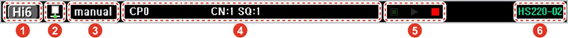

# Notation Convention

In this manual, the following notation conventions and safety instructions are used to help you understand the contents.

## Description of Figures

Figures are used to help you understand how to operate the product and illustrate what you can see on the screen. For the description of figures, numbers will be marked for the relevant parts, and the corresponding contents will be described as follows.

## GUI \(Graphical User Interface\)

On the GUI, menu names and button names are enclosed in square brackets \(\[ \]\) and displayed in bold. When you need to select multiple menus in order, mark them with the &gt; symbol between the names.

* Menu with a name: Touch the \[Menu\] button on the initial screen in manual or automatic mode.
* Multiple menus: Touch the \[Set Up\] button &gt; \[5: Initialize &gt; 7: Unit Setting\] menu on the initial screen in manual mode.

## Notation Method for Operation Keys

Keys that are to be pressed on the operation part of the teach pendant to operate functions will be enclosed in single arrow brackets \(&lt; &gt;\) and displayed in bold.

* If you press the &lt;Start&gt; key, the automatic operation of the program created in the robot will start.

## Cross Reference 

This provides the shortcut to the related information in the manual. Cross-references will be in quotation marks and in **bold type**.

* For details of making changes in date and time information, see “**4.5 Date and time setting**.” of “**Operation Manual for Hi6 Controller**” &#x20;

## Note

In this section are some helpful tips or additional information that could be useful when you use the product as follows.


When the icon blinks in the status bar, it means that you are in engineer mode.
