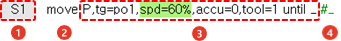

# Notation Conventions

This manual uses the following notation conventions and safety instructions to help understanding of the content.

### Figure Description

Figures are used to help understand product operation methods and explain screens. When figures are described, numbers are marked on the corresponding parts and the corresponding content is explained.

### GUI \(Graphical User Interface\)

GUI displays menu names and button names in bold within brackets \(\[ \]\). When multiple menus should be selected in order, the &gt; symbol is placed between names.

* Named menu: From the initial screen of manual or auto mode, select the \[__Menu__\] button.
* Multiple menus: From the initial screen of manual mode, select \[__System__\] button > &gt; \[5: __Initialization__ &gt; > 7: __Unit Settings__\] menu.

### Operation Key Notation

Keys to be pressed on the operation panel of the teach pendant for function operation are displayed in bold within angle brackets\(&lt; &gt;\).

* &lt;__Start__&gt; Pressing a key starts the automatic operation of the program written in the robot.

### Cross-reference

Provides shortcuts to related information within the manual. Cross-references are indicated in bold with quotation marks \(" "\).

* For more information about changing date and time information, see "[4.5 Date and Time Settings](https://hrbook-hrc.web.app/#/view/doc-hi6-operation/en-tp630/4-service/5-date-time-setting?cont_model=Hi7)" in the "[Hi7 Controller Operation Manual](https://hrbook-hrc.web.app/#/view/doc-hi6-operation/en-tp630/README?cont_model=Hi7)".

### Notes

Provides useful or additional information that is good to know when using the product.


If the </img> icon is blinking in the status bar, you are in engineer mode.


###